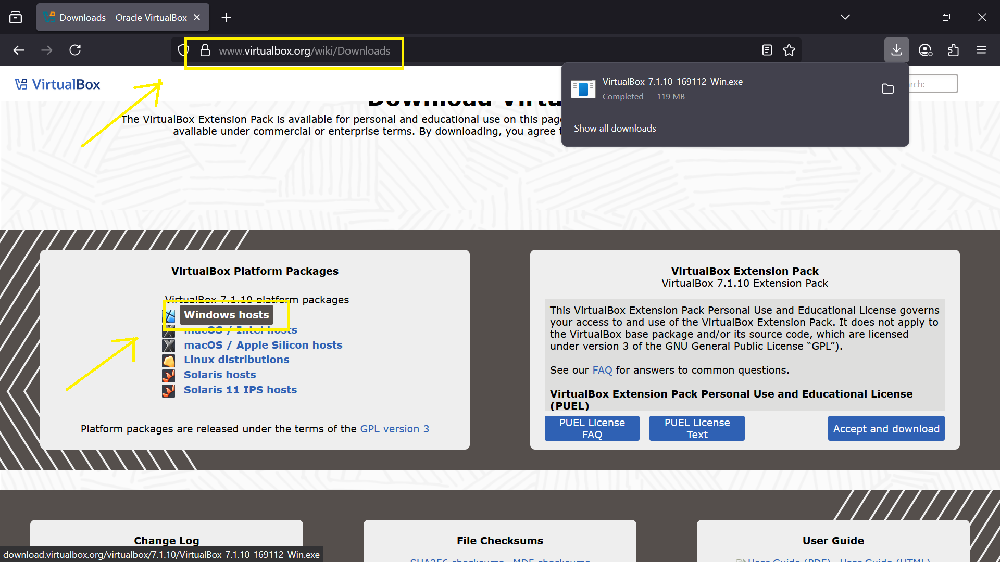
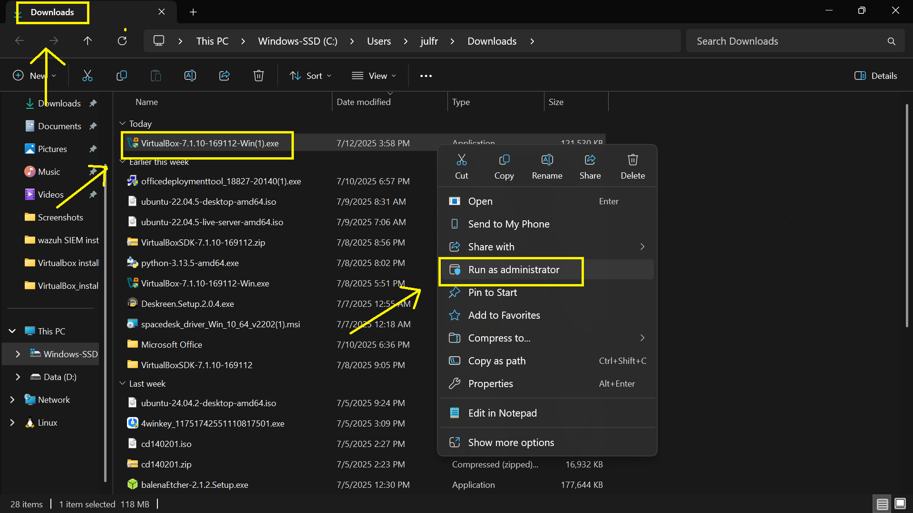
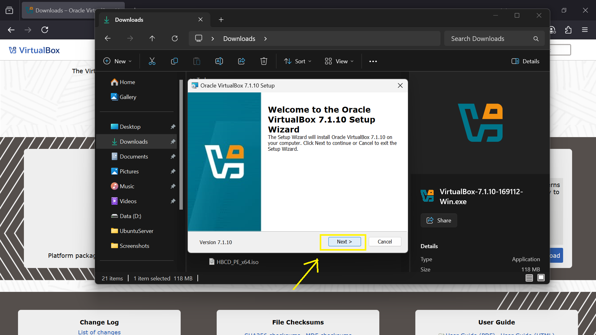
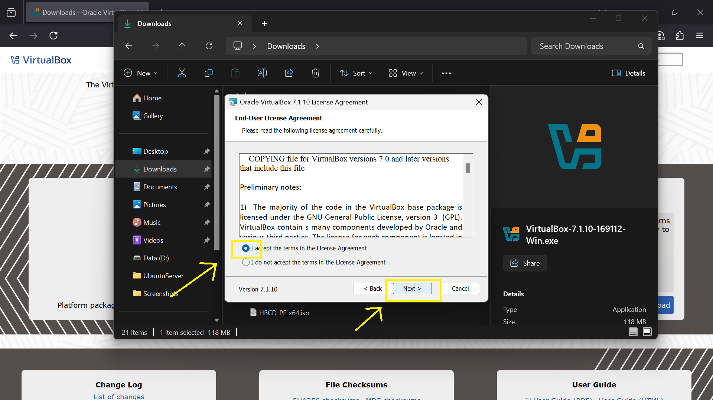
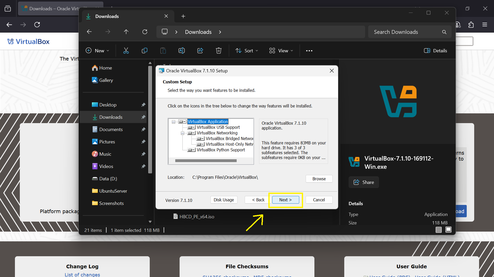
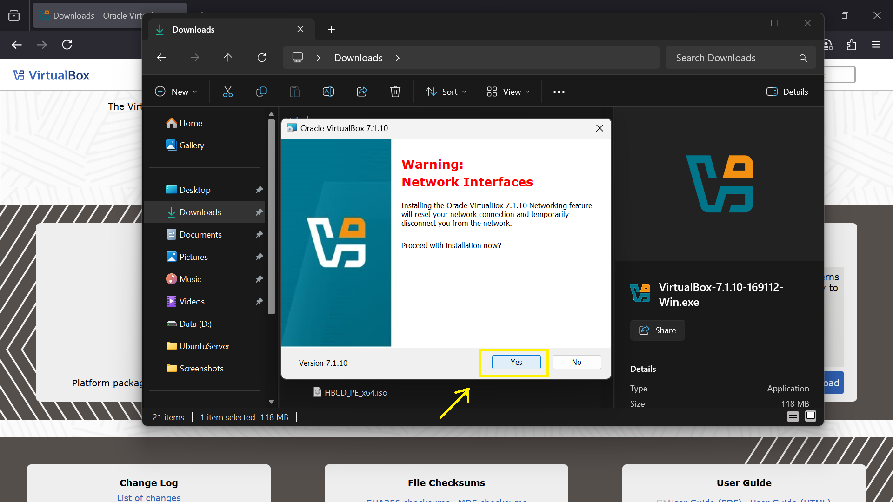
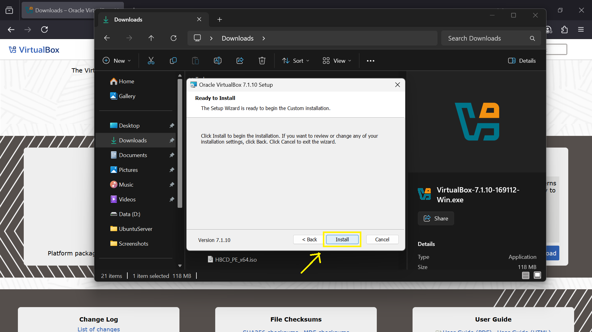
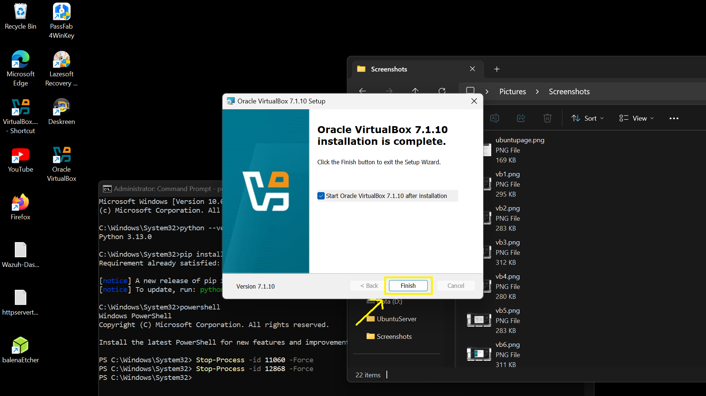
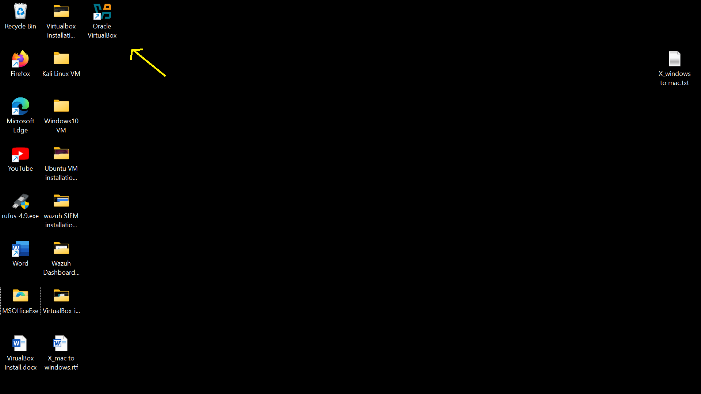
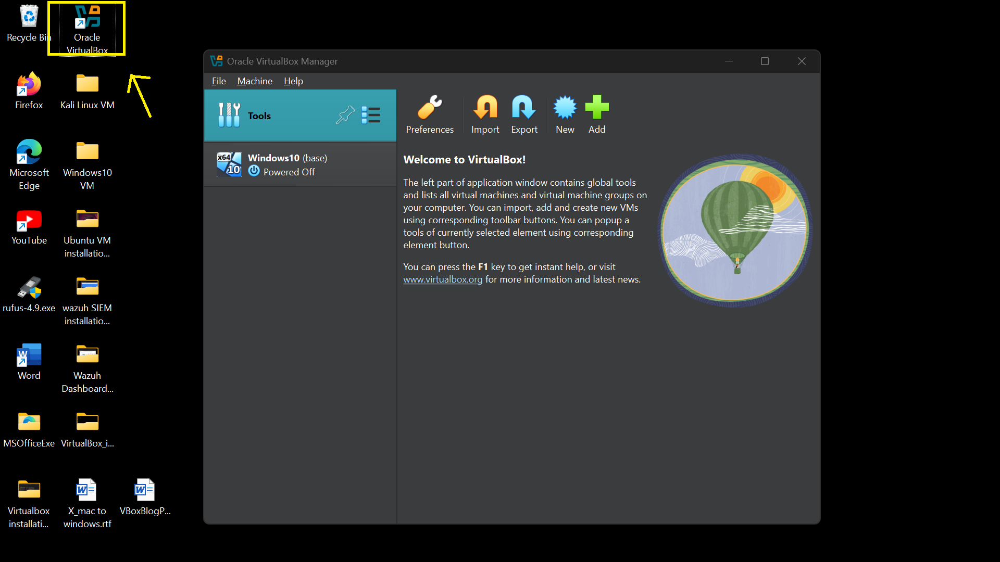

> **🖥️ How to Install VirtualBox on Windows 11 Home**
>
> If you're setting up a home lab or want to run virtual machines like
> Kali Linux, VirtualBox is a powerful
>
> and free virtualization tool from Oracle. Here's a beginner-friendly
> walkthrough to get you started.
>
> ⸻
>
> 💡 **Tip: Have an AI Assistant Ready!**
>
> When installing VirtualBox, you may run into unexpected
> errors---driver issues, virtualization settings,
>
> or networking problems. To save time and reduce frustration, keep an
> AI assistant like **ChatGPT** or
>
> **DeepSeek** open in your browser. These tools can help you **quickly
> troubleshoot** errors, explain cryptic
>
> messages, and guide you step-by-step through solutions. It's like
> having a tech-savvy friend on standby 24/7.
>
> They are not perfect, but a big help!
>
> ⸻
>
> **✅ Step 1: Download VirtualBox**
>
> 1\. Open your browser and go to the official download page:
>
> 👉 <https://www.virtualbox.org/wiki/Downloads>
>
> 2\. Click **"Windows hosts**" to download the VirtualBox installer for
> Windows.
>
> {width="5.069444444444445in"
> height="2.8472222222222223in"}
>
> ⸻
>
> **✅ Step 2: Run the Installer as Administrator**

1.  Once downloaded, go to your **Downloads folder**.

> 2\. Right-click the installer file "**VirtualBox-7.0.x-Win.exe**"
>
> 3\. Select "**Run as administrator**"
>
> {width="5.201388888888889in"
> height="2.923611111111111in"}
>
> ⸻
>
> **✅ Step 3: Begin Installation**
>
> 1\. Click **Next** to start the installation wizard.
>
> {width="5.201388888888889in"
> height="2.923611111111111in"}
>
> ⸻
>
> ✅ **Step 4: End User License Agreement and Choose Install Options**

1.  Tick the **"I accept the License Agreement"**.

2.  Click **Next**.

> {width="5.201388888888889in" height="3.0in"}
>
> Leave default options selected unless you have specific needs.
>
> • Click **Next**
>
> {width="5.201388888888889in" height="3.0in"}
>
> ⸻
>
> **⚠️ Step 5: Network Warning**
>
> You'll see a warning that your network may briefly disconnect ---
> **this is normal**.
>
> • Click **Yes** to continue.
>
> {width="5.333333333333333in" height="3.0in"}
>
> ⸻
>
> ✅ **Step 6: Missing Dependencies: Python Core / win32api**
>
> This appears because VirtualBox optionally supports scripting via
> Python.
>
> If you're not planning to automate VirtualBox with Python, click Yes
> to proceed.

- The optional dependencies (Python Core and win32api) can be added
  later.

- Instructions are at the bottom of the page if you would like to
  install them.

> {width="5.201388888888889in"
> height="2.923611111111111in"}
>
> ⸻
>
> ✅ **Step 7: Custom Setup**
>
> 1\. Choose from the options you want.
>
> 2\. Click **Next** to continue.
>
> {width="5.201388888888889in"
> height="2.923611111111111in"}
>
> ⸻
>
> ✅ **Step 7: Ready to Install**
>
> • Click **Next**
>
> {width="5.201388888888889in"
> height="2.923611111111111in"}
>
> ⸻
>
> ✅ **Step 7: Finish Setup**
>
> 1\. When finished, leave "**Start Oracle VM VirtualBox after
> installation**" checked.
>
> 2\. Click **Finish**
>
> {width="5.201388888888889in"
> height="2.923611111111111in"}
>
> The VirtualBox shortcut icon should appear on your desktop.
>
> {width="5.201388888888889in"
> height="2.923611111111111in"}
>
> **!!!! REBOOT** your system**!**
>
> ⸻
>
> ✅ **Step 8: Launch VirtualBox**
>
> You should now see the VirtualBox interface. From here, you can create
> your first virtual machine!
>
> {width="5.201388888888889in"
> height="2.923611111111111in"}
>
> ⸻
>
> 🎉 Done!
>
> You've now successfully installed VirtualBox on your Windows 11 Home
> system.
>
> You're ready to create VMs for Kali Linux, Ubuntu Server, pfSense, or
> anything else!
>
> ⸻
>
> ✅ **Adding the Missing Dependencies**

❗ **Note:**

• This **only matters if** you're planning to automate VirtualBox using
Python scripts.

• If you're just creating and running VMs manually through the GUI, you
can **safely ignore this**

**step.**

🐍 **Step 1: Install Python (If not already installed)**

> 1\. Go to <https://www.python.org/downloads/>
>
> 2\. Download and install the latest **Python 3.x**
>
> 3\. During installation, make sure to check:
>
> ✅ **"Add Python to PATH"**

[📦]{.mark} **Step 2: Install pywin32**

Once Python is installed, open **Command Prompt** and run:

*pip install pywin32*

⸻

[🔁]{.mark} **Step 3: Verify Installation**

In the same terminal, try:

*python -c \"import win32api; print(win32api.GetVersionEx())\"*

You should get version output with no errors.
