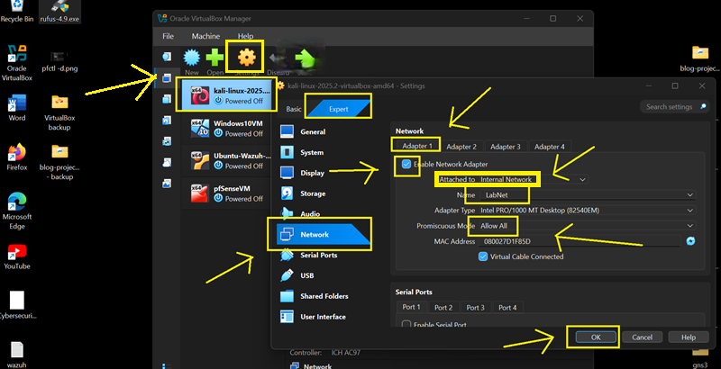
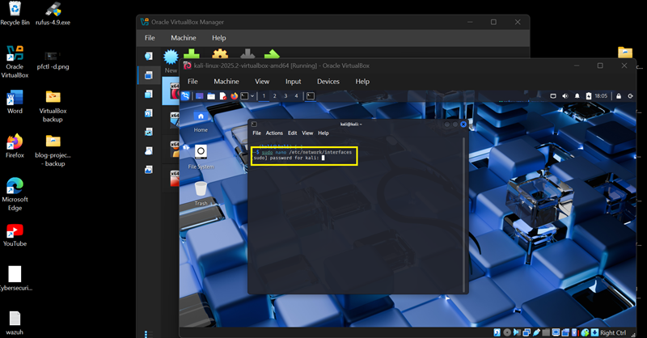
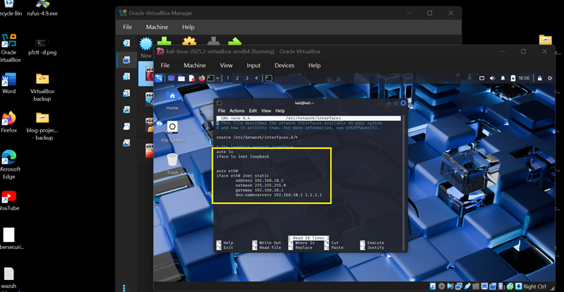
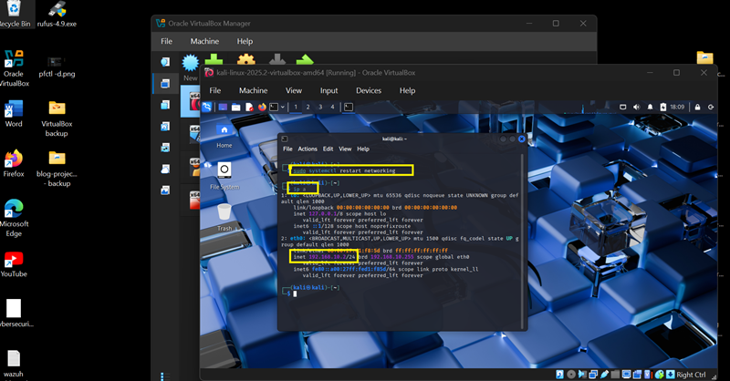
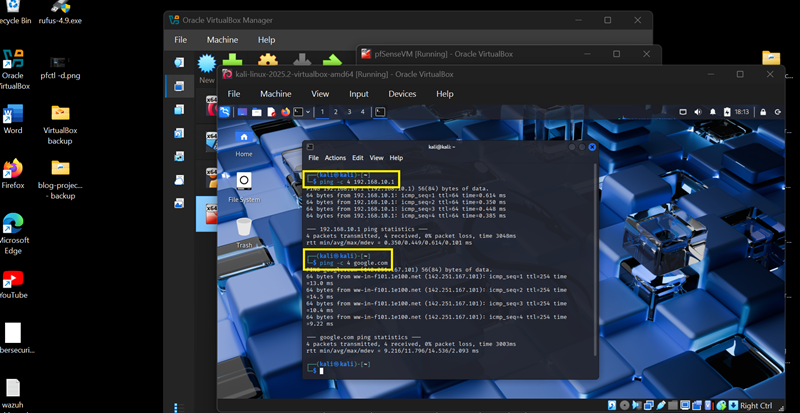
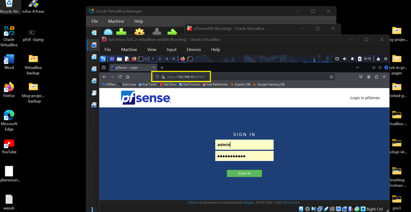
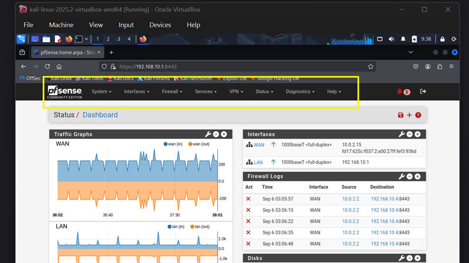

## 🛡️ Part 2: Kali-Linux VM — Adapter Settings & LAN IP Configuration

### 📌 Introduction

    In this part of the lab, we’ll configure Kali Linux with a static IP address on the Internal Network (LabNet). This ensures that Kali can reliably communicate with the pfSense firewall and other virtual machines in the lab environment. By assigning a fixed IP, we avoid conflicts and make it easier to run tools, perform scans, and simulate real-world attack/defense scenarios.

### 💡 Tip: Keep ChatGPT Handy

    If Kali ignores your changes, it might be NetworkManager interfering. Here's a sample promt for ChatGPT  
      
    “Kali keeps overwriting my /etc/network interfaces config. How do I disable NetworkManager and make static IP 192.168.10.2 persistent?”


---

### 🔹 Step 1: Kali-Linux VM Adapter Configuration

1. **Power off** the Kali-Linux VM.

2. Navigate to **Settings** → **Network**

- **Adapter 1 (LAN):**

  - Check **Enable Network Adapter** [✓]
  - Name: **LabNet** (or any name you want just make sure that all VMs have the same network name)
  - Attached to: **Internal Network**
  - Promiscuous Mode: **Allow All**
  - Click **OK**




---

### 🔹 Step 2: Configure LAN Static IP Address

1. Boot Kali-Linix VM 

2. Assign interfaces and Static IP Addresses:

- Edit the **interfaces** config file:

	Run Command:
    
        `sudo nano /etc/network/interfaces`
			
- Enter password: 	`kali` (or your updated password)



3. Add the following configurations:

  ```bash
    auto eth0
    iface eth0 inet static
        address 192.168.10.2
        netmask 255.255.255.0
        gateway 192.168.10.1
        dns-nameservers 192.168.10.1 1.1.1.1
```


4. To save configuration and close editor: `ctrl + x`, then press `Enter`, then press `y`



5. Restart networking: 

	Run Commands:

        `sudo systemctl restart networking`

        `ip a`

•	The Static IP Address of Kali Linux VM is now set to **192.168.10.2**

 

6. Check connectivity: 

	Run Commands:  

         `ping -c 4 192.168.10.1`

         `ping -c 4 google.com`
		
**Note:** The first ping command is to check connectivity with pfSense VM (internal network). The second ping is to check connectivity to google.com (internet). If the connection ‘timed-out’ – means connection failed. If there are packets transmitted – means success in connection.



7. Check pfSense Firewall GUI access: 

	- Open browser
	- Access pfSense GUI via: 	https://192.168.10.1:8443



•	Now you have an environment to practice and experiment with firewall rules!



---
👉 [Part 2.b: Configure Network Settings for Ubuntu Wazuh VM](/11w3.md) 

🔙 [Back to Home](../index.md) 