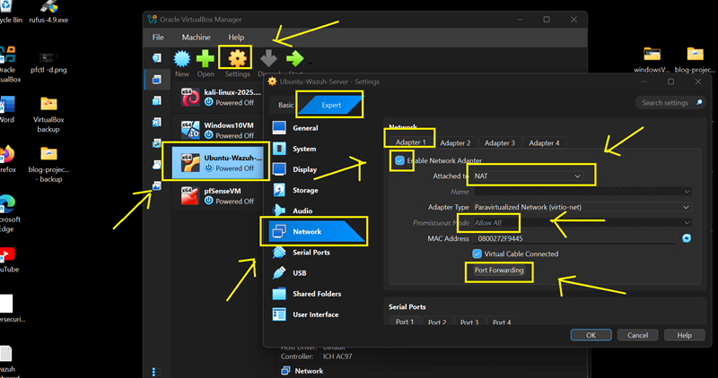
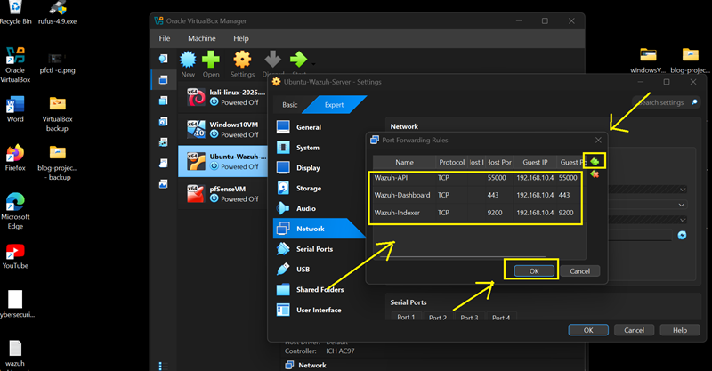
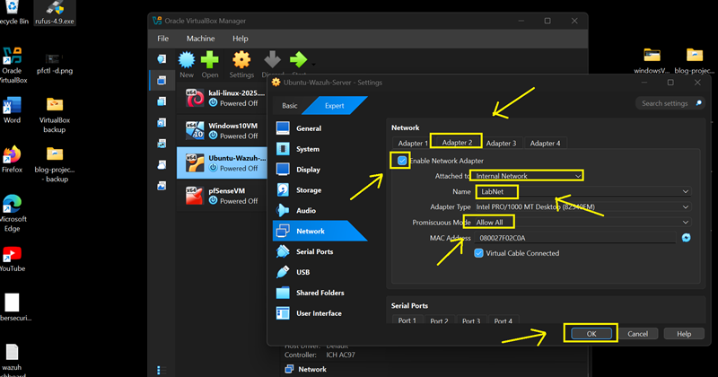
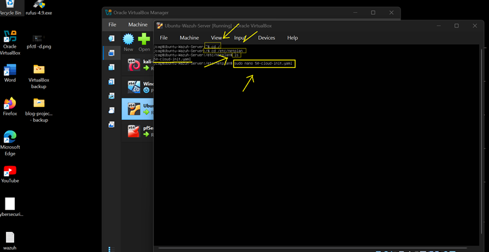
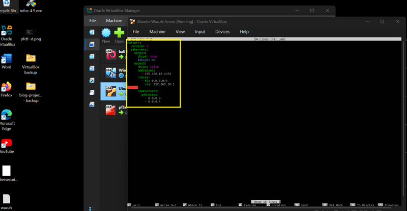
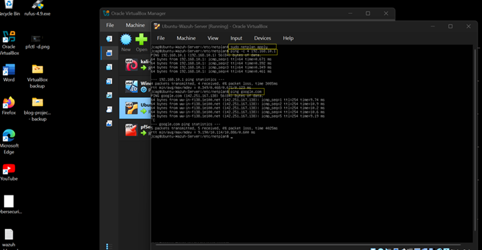
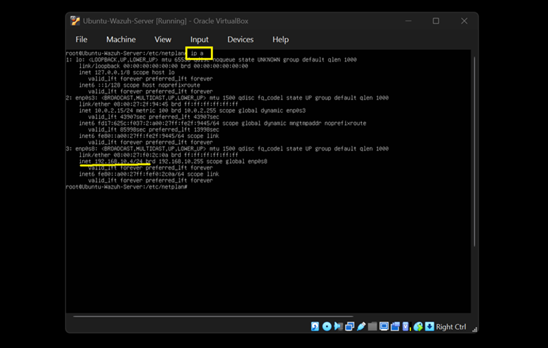
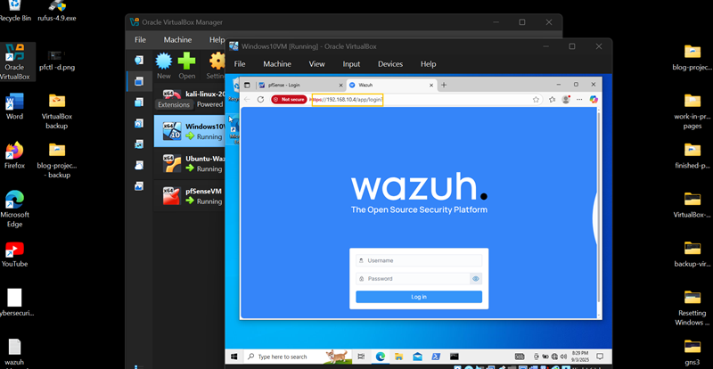
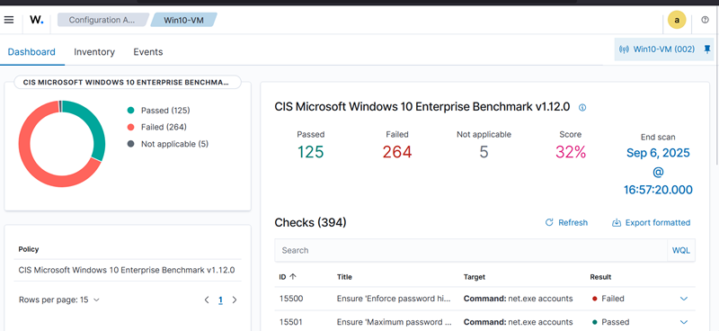

## 🛡️ Part 3: Ubuntu-Wazuh VM  — Adapter Settings & LAN IP Configuration

### 📌 Introduction

    In this part of the lab, we’ll configure the Ubuntu Wazuh VM with two network adapters, similar to the pfSense setup: NAT for external access, including port forwarding to allow updates and remote management, and Internal Network for LAN connectivity, enabling communication with pfSense, Kali Linux, and other lab VMs. This setup ensures that Wazuh can function as a central monitoring and security server within the home lab environment while remaining accessible for management tasks.

### 💡 Tip: Keep ChatGPT Handy

    If Ubuntu drops connection or refuses to apply Netplan config changes, here's a sample prompt for ChatGPT:  
    
    "Ubuntu VM won't take static IP 192.168.10.4 via Netplan, here's my /etc/netplan/50-cloud-init.yaml. Can you fix indentation or syntax issues?"

---

### 🔹 Step 1: Ubuntu Wazuh Adapters [1 (WAN) & 2 (LAN)] Configuration

1. **Power off** the Ubuntu Wazuh VM.

2. Navigate to **Settings** → **Network**.

- **Adapter 1 (WAN):**

  - Check **Enable Network Adapter** [✓]
  - Attached to: **NAT**
  - Promiscuous Mode: **Allow All**
  - Click **Port Forwarding**



3. Click **'+'** (Add button) to add Port Forwarding Rules:

- Set the Following (we will set 3 three rules):

  - Name: **Wazuh-API**
  - Protocol: **TCP**
  - Host IP: **(leave blank)**
  - Host Port: **5500**
  - Guest IP: **192.168.10.4**
  - Guest Port: **5500**

- Set the Following:

  - Name: **Wazuh-Dashboard**
  - Protocol: **TCP**
  - Host IP: **(leave blank)**
  - Host Port: **443**
  - Guest IP: **192.168.10.4**
  - Guest Port: **443**

- Set the Following:

  - Name: **Wazuh-API**
  - Protocol: **TCP**
  - Host IP: **(leave blank)**
  - Host Port: **5500**
  - Guest IP: **192.168.10.4**
  - Guest Port: **5500**

4. Click **OK**
	


- **Adapter 2 (LAN):**

  - Check **Enable Network Adapter** [✓]
  - Attached to: **Internal Network**
  - Name: **LabNet** (or any name you want, just make sure all VMs have the same network name)
  - Promiscuous Mode: **Allow All**
  - Click **OK** to save settings and exit.  



---

### 🔹 Step 2: Configure LAN Static IP Address

1. Boot Ubuntu Wazuh VM

2. Edit the Netplan config file:<br>
**Note:** `sudo su` (elevates user privilege to ‘root’ for config file access)
            `cd /`  (change directory to ‘root’ directory).
            `cd /etc/netplan`  (change directory from ‘root’ to ‘netplan’ directory).
            `ls` (lists files under ‘netplan’ directory and check if config file exists).
            `nano 50-cloud-init.yaml`  (opens the ’50-cloud-init.yaml’ file to be edited).
            
            
        Run commands:

            `sudo su`
            - Enter password when prompted: <your_Ubuntu_VM_password> 
            `cd /`
            `cd /etc/netplan`
            `ls` 
            `nano 50-cloud-init.yaml`



3. Add the following configurations:

	**Important Note**: Proper indentations should be observed when adding this configuration. Incorrect indentations will result to ERRORS! Check your indentations carefully!
```markdown
Insert this configuration in the config file.
WATCH THE INDENTATION! WRONG INDENTATIONS WILL CAUSE ERROR!

network:
  version: 2
  ethernets:
    enp0s3:
      dhcp4: true
    enp0s8:
      dhcp4: false
      addresses:
        - 192.168.10.4/24
      routes:
        - to: 0.0.0.0/0
          via: 192.168.10.1
      nameservers:
        addresses:
          - 1.1.1.1
          - 8.8.8.8
```

4. To save configuration and close editor: `ctrl + x`, then press `Enter`, then press `y`



5. Apply config and check for connectivity:

    Run commands:
                
    `sudo netplan apply`

    `ping -c 4 192.168.10.1`

    `ping -c 4 google.com`

 

6. Check IP address:

    Run command:
    
    `ip a`

•	The Static IP Address of Ubuntu-Wazuh is now set to **192.168.10.4**



•	The Wazuh-Dashboard can now be access by opening the following URL on Kali Linux or Windows10 VM browser after their Adapter setup:
	
	https://192.168.10.4:443



•	Now you have a system that allows you to monitor activities and identify vulnerabilities on both the Kali Linux and Windows 10 VM endpoints. This setup also gives you the flexibility to experiment with different areas of the SIEM, such as log collection, alert creation, and incident response workflows.



---
👉 [Part 2.c: Configure Network Settings for Windows 10 VM](/12w4.md) 

🔙 [Back to Home](../index.md) 
