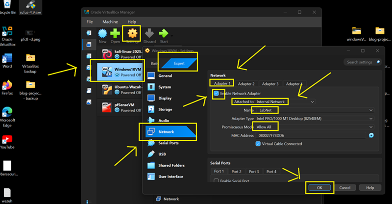
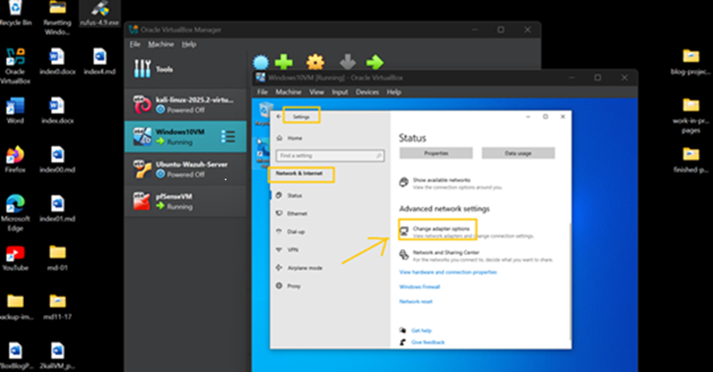
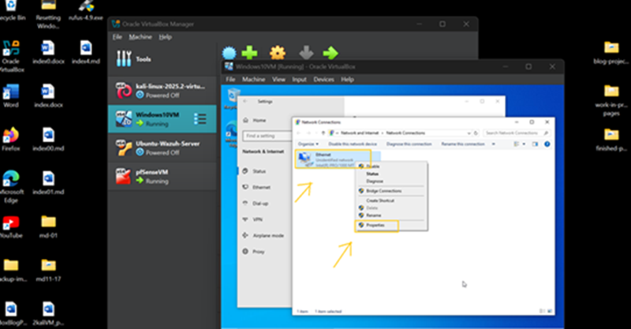
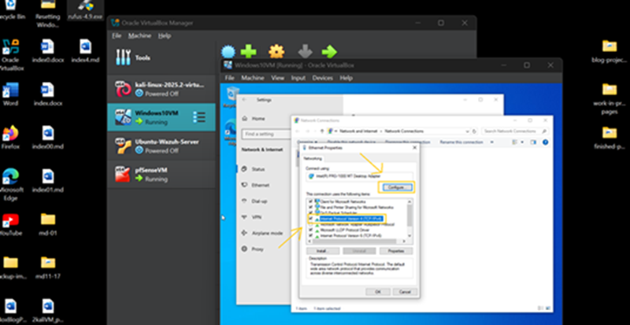
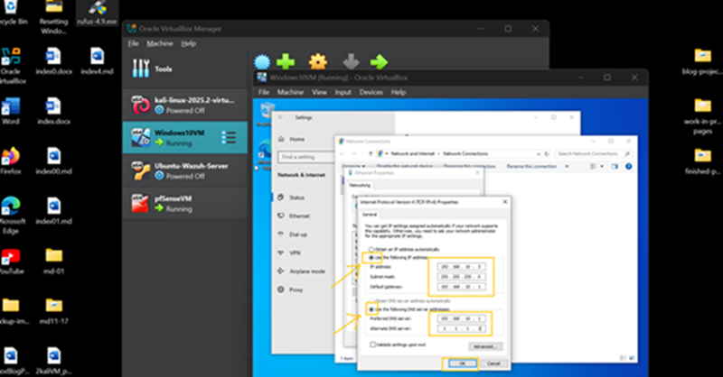
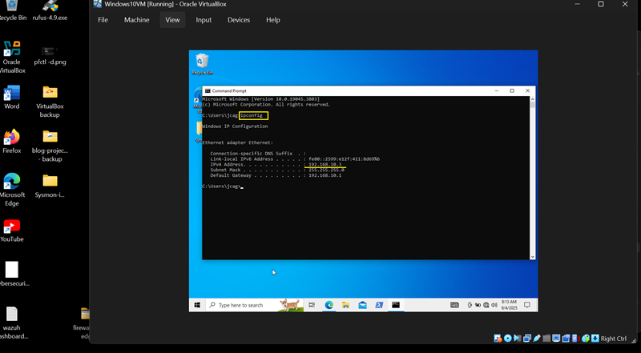
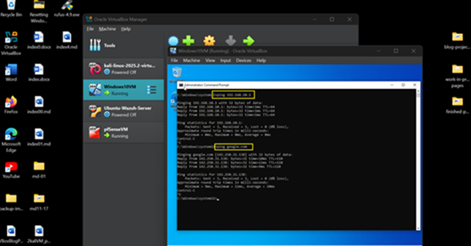
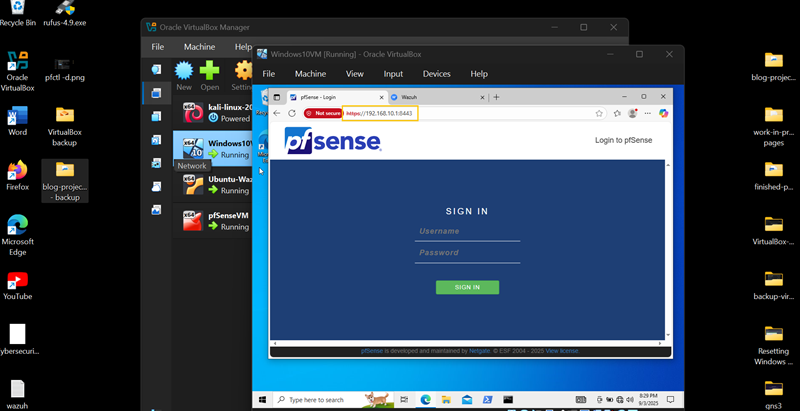
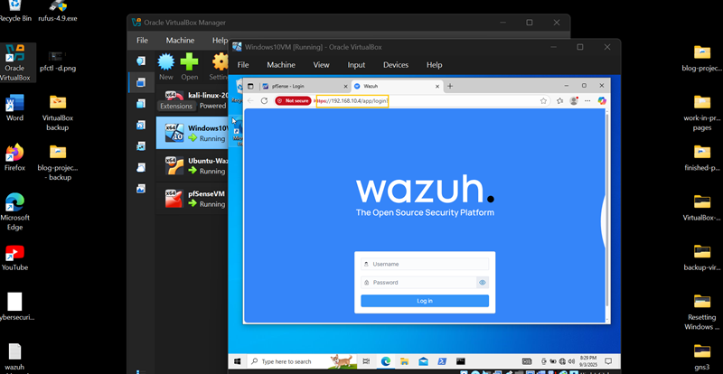

## 🛡️ Part 4: Windows 10  VM — Adapter Settings & LAN IP Configuration

### 📌 Introduction

    In this part of the lab, we’ll configure the Windows 10 VM with a static IP address for LAN connectivity.  This setup ensures that the VM can reliably communicate with the lab network and participate in testing, monitoring, and interactions within the SOC lab environment.

### 💡 Tip: Keep ChatGPT Handy

    If Windows shows “Unidentified Network” or won’t connect, here's a sample promt for ChatGPT:  
      
    “Windows 10 VM on VirtualBox (Internal Network: LabNet) isn’t detecting gateway 192.168.10.1.  Here's are my adapter and TCP/IPv4 settings: <provide settings here>. What should I adjust”

---

### 🔹 Step 1: Windows 10 VM Adapter Configuration

1. **Power off** the Kali-Linux VM.

2. Navigate **Settings** → **Network**.

- **Adapter 1 (LAN):**

  - Check **Enable Network Adapter** [✓]
  - Name: **LabNet** (or any name you want just make sure that all VMs have the same network name)
  - Attached to: **Internal Network**
  - Promiscuous Mode: **Allow All**
  - Click **OK**

---

### 🔹 Step 2: Configure LAN Static IP Address

1. Boot Windows 10 VM 

2. Configure **Ethernet** (Virtual Adapter) Static IP Addresses:

**Note:** There are different ways of to assign an IP to Windows 10VM. This time we will use Windows graphical interface instead of using CLI(Command-Line Interface).

- Navigate to **Settings** → **Network**

- click **Change adapter options** 

3\. Right-click **Ethernet icon**, then click **Properties**

4\. Click **Internet Protocol Version 4 (TCP/IPv4)**, then click **Configure**

5\. Set the following:

- Choose **Use the following IP address:**

   	- IP address:            **192.168.10.3**
   	- Subnet Mask: 		     **255.255.255.0**
   	- Default Gateway: 		 **192.168.10.1**
   	
- Choose **Use the following DNS server addresses:**

    - Preferred DNS server:  **192.168.10.1**
    - Alternate DNS server:  **1.1.1.1**

6\. Click **OK**

7\. Open Command Prompt

		Run command:
        
            `ipconfig`

•	The Static IP Address of Windows 10 VM is now set to **192.168.10.3**

8\. Check for connectivity: 

        Run command:
    
            `ping -c 4 192.168.10.1`

            `ping -c 4 google.com`

**Note:** The first ping command is to check connectivity with pfSense VM (internal network). The second ping is to check connectivity to google.com (internet). If the connection ‘timed-out’ – means connection failed. If there are packets transmitted – means success in connection.

9\. Check pfSense Firewall GUI access: 

	- Open browser
	- Access pfSense GUI via: 	 **https://192.168.10.1:8443**

10\. Check Wazuh-Dashboard access: 

	- Open browser
	- Access pfSense GUI via: 	**https://192.168.10.4:443**

---

🎉 Done! You now have a fully functional **SOC Home Lab** with a **pfSense virtual firewall** for traffic filtering, a **SIEM** for endpoint monitoring, and both an **attack machine** and **target machine** to simulate real-world scenarios. This environment allows you to **practice log analysis**, **test detection rules**, **simulate attacks**, and **strengthen your incident response skills**—all in a **safe and controlled setup**.

👉 Next, we’ll take things a step further by building a **network in a cloud environment**, integrating **Splunk** for advanced log analysis, and exploring **automation**. We’ll also look at ways to **assimilate the cloud lab with our home SOC setup**, creating a more realistic, hybrid environment for testing and learning.

---
🔙 [Back to Home](../index.md) 