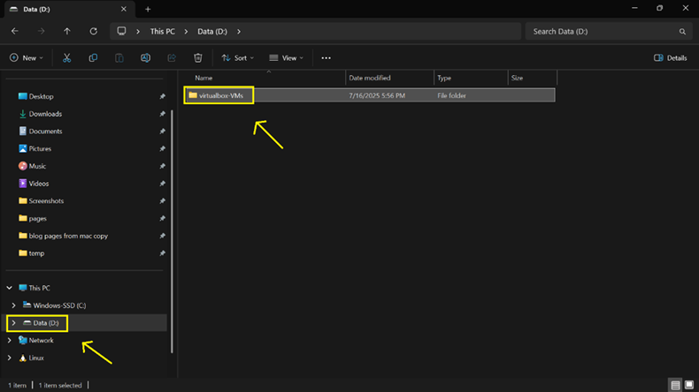
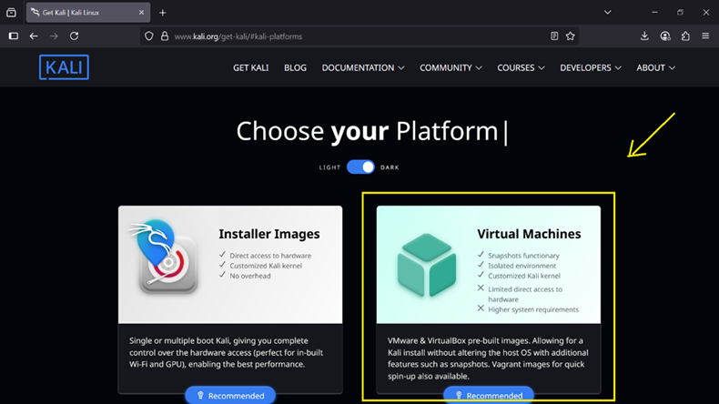
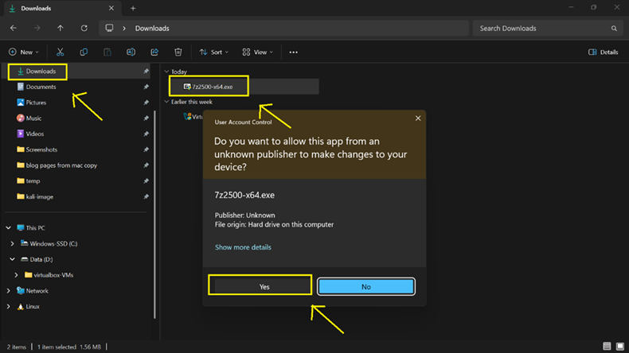
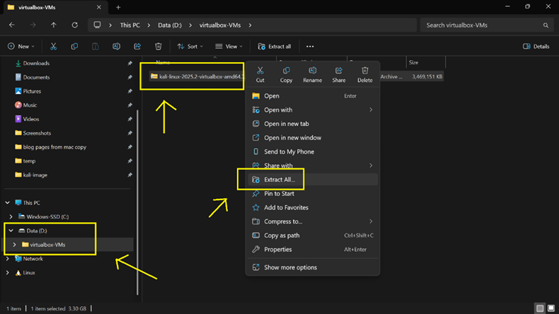
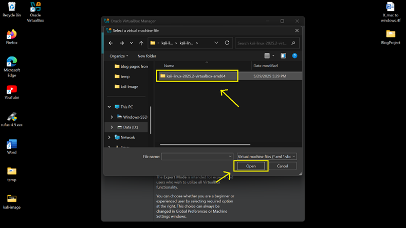
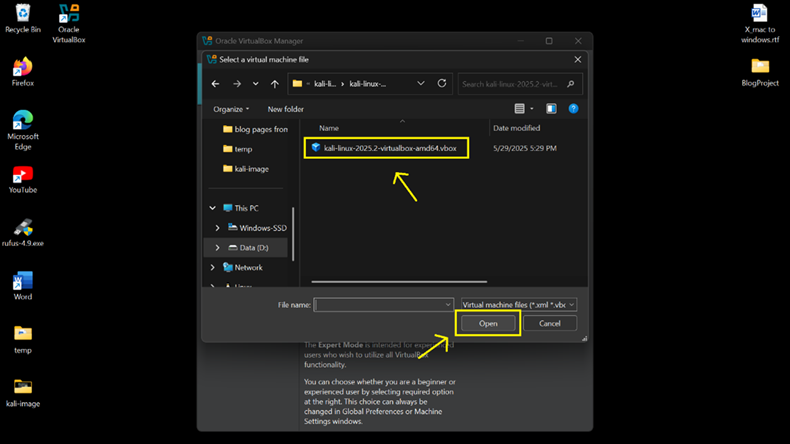
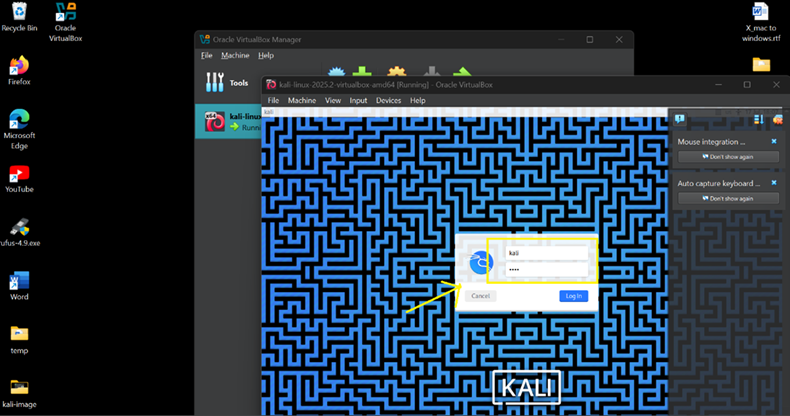

## **💽 How to Install Kali Linux VM on Windows 11 -- Stored on Drive D)**

> This step-by-step guide shows you how to install Kali Linux VM on Windows 11 
> using the .7z file prebuilt image from Kali.org and store the VM in Drive D:. 
> 	**Note:** If you don't have Drive D: just use default C:

---

**On this tutorial you'll learn how to:**

• Create and use a folder on Drive D: for a better organized VMs, therefore, saving C: storage space. 

• Download and extract the .7z Kali Linux image and extract the file
with 7-Zip utility.

• Import the VM into VirtualBox

• Set the default machine folder to D:\\virtualbox-VMs

---

**💡 Tip: Keep an AI Assistant Handy During VM Setup!**

> Installing an OS in a VM can cause issues like boot failures to display bugs.
> Keep an AI assistant like **ChatGPT** ready to help troubleshoot errors, BIOS > settings, or installer problems quickly.

---

### **📁 Step 1: Create a Folder in Drive D: for Your VMs(skip this step if you don't have Drive D:)

- To keep your C: drive clean and avoid space issues, we'll store Kali
and future VMs in a custom folder on D:

1\. Press **Win** + **E** to open **File Explorer**

2\. Go to **This PC** \> **Data (D:)**

3\. Right-click → New \> Folder

 

4\. Name it: **virtualbox-VMs**

 

⸻

### **📥 Step 2: Download the Kali Linux VirtualBox Image**

1\. Go to: 👉
[https://www.kali.org/get-kali/#kali-platforms](https://www.kali.org/get-kali/%23kali-platforms)

2\. Click **Virtual Machines**.

 

3\. You'll be redirected to the **Pre-built Virtual Machines** page.

4\. Click **VirtualBox** to download
**kali-linux-2025.2-virtualbox-amd64.7z**.

 
5\. Navigate to **Downloads** folder, right click on
**kali-linux-2025.2-virtualbox-amd64.7z**,
then click **Copy** to copy the file to **D:\\virtualbox-VMs\\. (Skip this and the next step if you don't have Drive D:)**

 

6\. Go to **This PC** \> **DATA (D:)** \> **virtualbox-VMs** then
**Paste**.

 

⸻

### **🧰 Step 3: Download and Install 7-Zip Utility Tool (to Extract the .7z
File)**

1\. Visit: 👉 <https://www.7-zip.org/>

2\. Download the **64-bit x64 installer**

 

3\. Run the installer and complete setup.

 

 
⸻

### **🗂️ Step 4: Extract the Kali VM from kali-linux-2025.2-virtualbox-amd64.7z.**

> **Note:** If you don't have Drive D:, you can extract Kali VM in your
> Download folder or move the .7z file to a different folder where you want to 
> save all your VMs and do your file extraction in that folder.

1\. Go to: **D:\\virtualbox-VMs\\**

2\. Right click **kali-linux-2025.2-virtualbox-amd64.7z** then select
**Extract All**.

 

3\. Click **Extract**

 
⸻

### **📂 Step 5: Set VirtualBox to Use D:\\VirtualBox VMs by Default(skip this if you don't have Drive D:)**

1\. Open **VirtualBox**

2\. Go to: **File** \> **Preferences** \> **General**

3\. Under **Default Machine Folder**, set to**: D:\\virtualbox-VMs**

4\. Click **OK**

 

⸻

### **💻 Step 6: Import Kali-Linux into VirtualBox**

1\.  On **VirtualBox**: Go to **Machine** \> **Add**

 

2\. Navigate to: **D:\\VirtualBox VMs\\kali-linux-2025.2-virtualbox-amd64**,
       then **double click** or click **Open**.

 

3\. Double click **Kali-Linux-2025.2-virtualbox-amd64.vbox**.

 

⸻

### **🚀 Step 7: Start the Kali-Linux VM**

1\. Select the **Kali-Linux VM** in **VirtualBox**

2\. Click **Start**

3\. Wait for Kali-Linux to boot

 

⸻

### **🔐 Step 8: Login Credentials**

> Username: **kali**
>
> Password: **kali**

 

After login, you're ready to explore the Kali Linux environment.

 

---

### **✅ You're Done!**

> This is just one way of installing a Virtual Machine, you can also
> install a VM by mounting an .ISO image file. We will try to do that
> with the Windows 10 VM in next tutorial. But for now, you've
> successfully installed Kali Linux in VirtualBox on Windows 11 system,
> and you can start practicing some [Linux commands](/LinuxCom.png).

[👉 Install Windows 10 VM](/2WinVM_page.md)

[🔙 Back to Home](../index.md)
