**!!! NOTE:** If you haven't installed VirtualBox, I strongly suggest you start with that first, then followed by installing Kali-Linux VM. VirtualBox is where the Home Lab setup will reside, therefore, it is necessary that it has to be installed first, followed by Kali-Linux installation.

## **🪟 How to Install Windows VM on Windows -- Stored on Drive D:)**

> This step-by-step guide shows you how to Windows 10 VM on Windows 11 
> using the .iso image file from Microsoft and store the VM in Drive D:. 
> 	**Note:** If you don't have Drive D: just use default C:

---

**💡 Tip: Keep an AI Assistant Handy During VM Setup!**

> Installing an OS in a VM can cause issues like boot failures or display bugs. 
> Keep an AI assistant like **ChatGPT** open to help troubleshoot errors,BIOS 
> settings, or installer problems quickly.

---
**✅ Minimum System Requirements for Windows 10 ISO Installation**

> **Processor:** 		1 GHz or faster CPU or SoC (32-bit or 64-bit)\
> **RAM:** 			1 GB for 32-bit, or 2 GB for 64-bit\
> **Storage:** 		16 GB for 32-bit OS, or 20 GB for 64-bit OS\
> **Graphics Card:**	DirectX 9 or later with WDDM 1.0 driver\
> **Display:** 		800×600 resolution or higher\
> **Firmware:** 		BIOS or UEFI

---

### **📥 Step 1: Download a Windows ISO File**

- Since this is for lab testing, **Windows 10 is suitable** due to its
  lower system requirements.

🔷 For **Windows 10**:

1\.  Navigate to: 👉 <https://www.microsoft.com/software-download/windows10>

2\.  Click **Download Now**

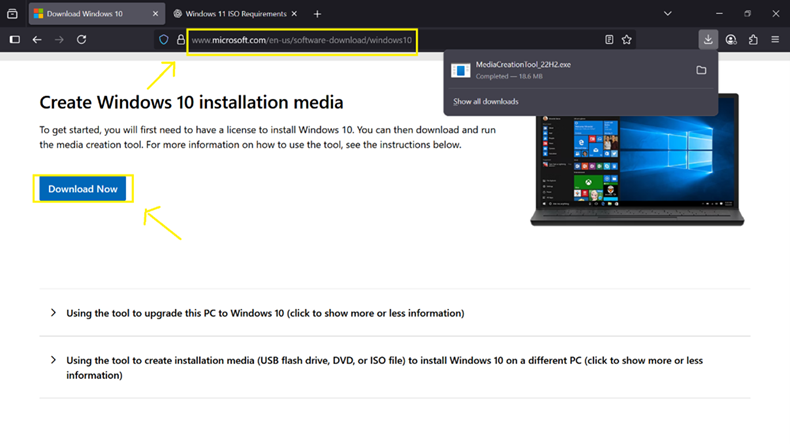 

3\.  Go to **Download folder**

4\.  Double click **MediaCreationTool_22H2.exe**

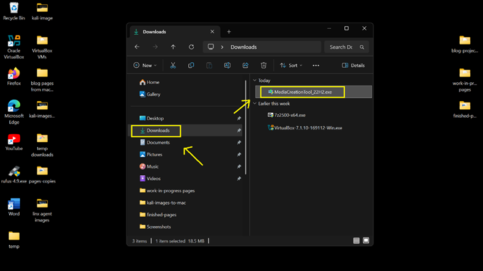 

5\.  Click **Yes** User Account Control

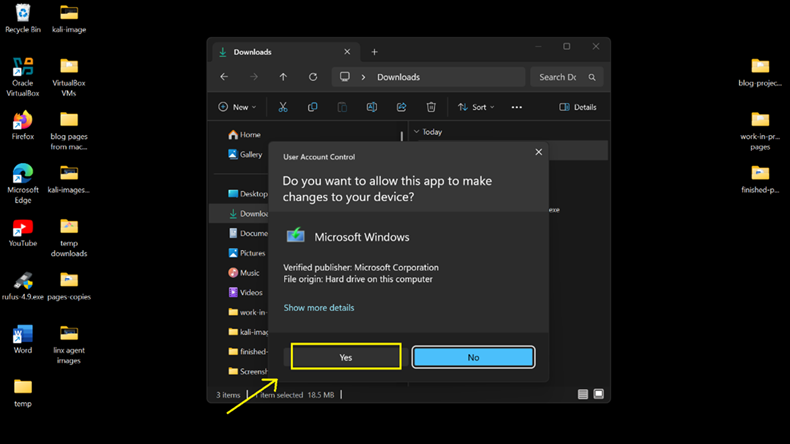 

6\.  Click **Accept** to continue

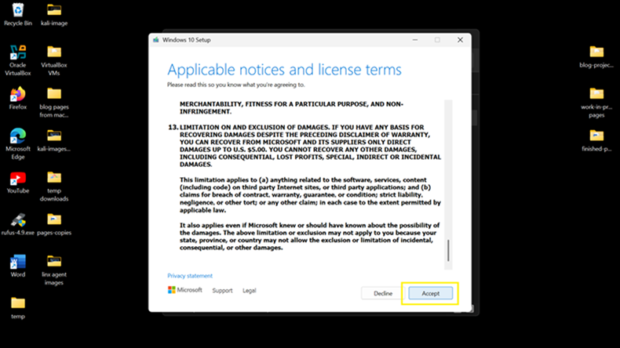 

7\.  Select **Create installation media**, then click **Next**.

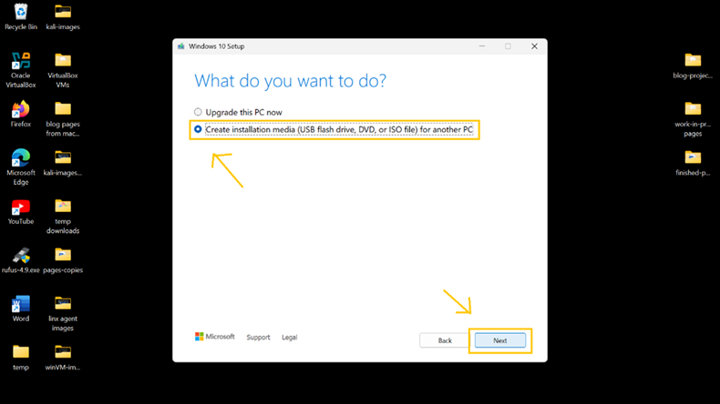 

8\.  Click **Next**

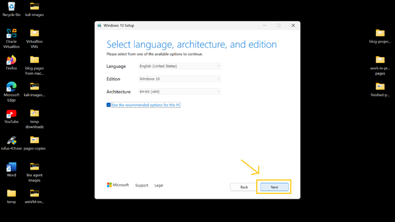 

9\.  Choose **ISO file**, then click **Next**

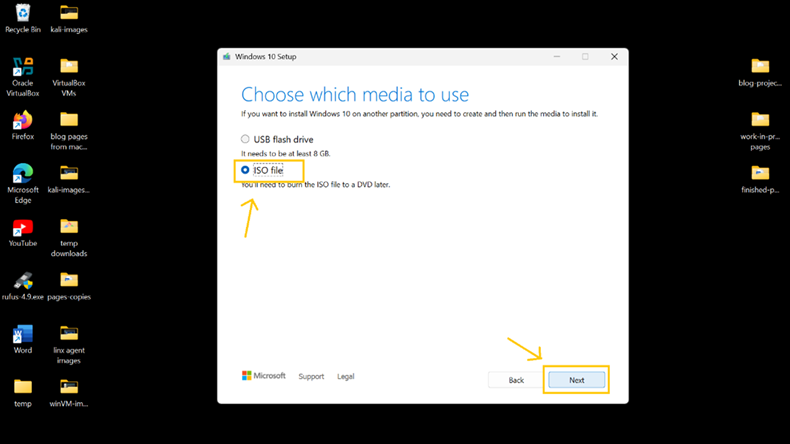 

10\. Choose the existing **D:\\virtualbox-VMs** folder where Kali-Linux
    was saved.

11\. Save Windows 10 ISO in **D:\\virtualbox-VMs** folder.

> **Note:** If you don't have Drive D: --- I recommend that you store the 
> ISO file where Kali-Linux was saved on C: to organized the VMs.

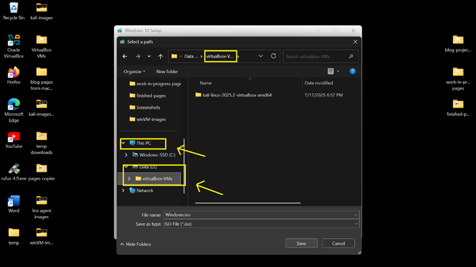 

12\. Click **Finish**

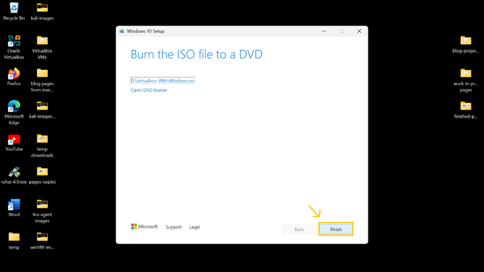 

⸻

### **💻 Step 2: Open VirtualBox and Create the Windows VM**

1\.  On VirtualBox, click **New**

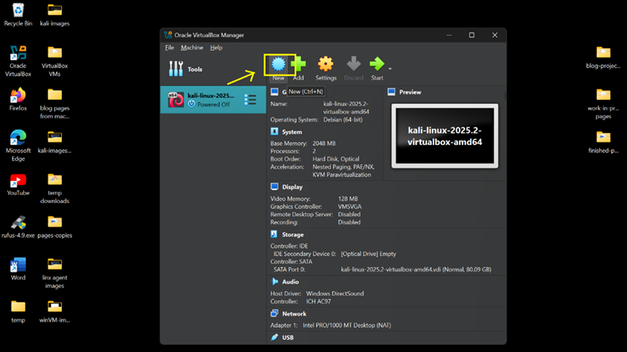{ 

2\. Name your VM: **Windows10VM**

3\. ISO Image: click the **drop-down arrow** at the far right \> click
**other**

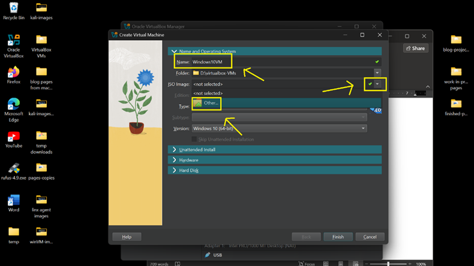 

4\. choose **Windows.iso**, click **Open**

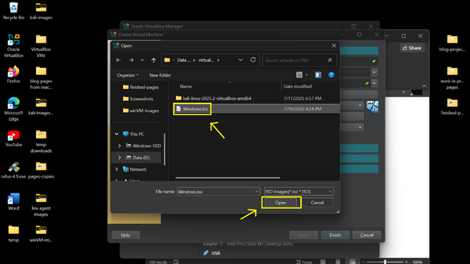 

5\. Confirm ISO Image: **Windows.iso**

> Type: **Microsoft Windows**
>
> Version: **Windows 10 (64-bit)**

6\. Click **Unattended Install**

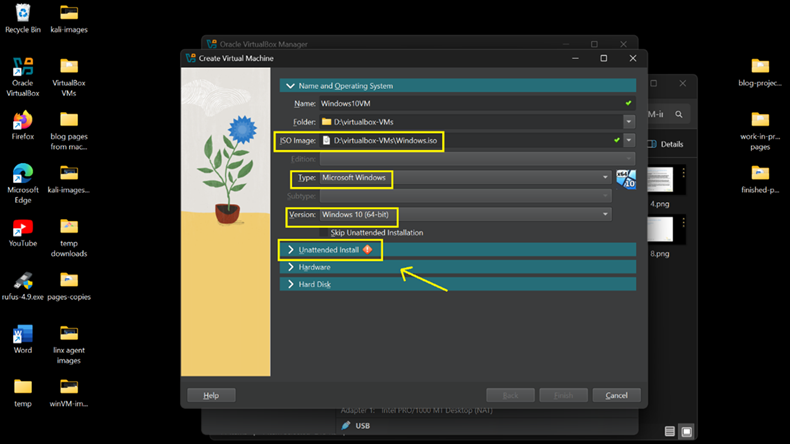 

7\. Set 

> Username: \<your_username\>
>
> Password: \<your_password\>
>
> **Note:** Since this VM will only be use for Lab practice, you can 
> 		leave the Hardware and Hard disk to the given default resource 
>		allotment:
>
> Base Memory: **2048 MB** 
> Processor: **1 CPU Hard Disk: 50 GB** 

8\. Click **Finish**

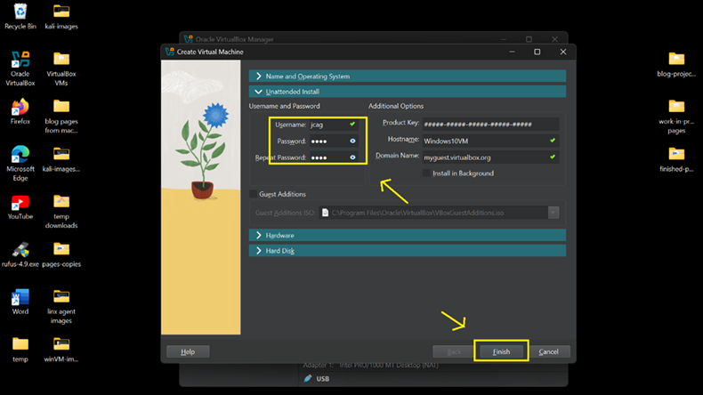 

⸻

### **⚙️ Step 3: Configure VM Storage Settings**

>\ **TIP**: If you run into any problems setting this up, you can turn to 
> 		**ChatGPT** for solutions. If the output is not the right solution, 
>		keep refining your prompt and hopefully you'll get the right one.

1\.  Click **Settings**

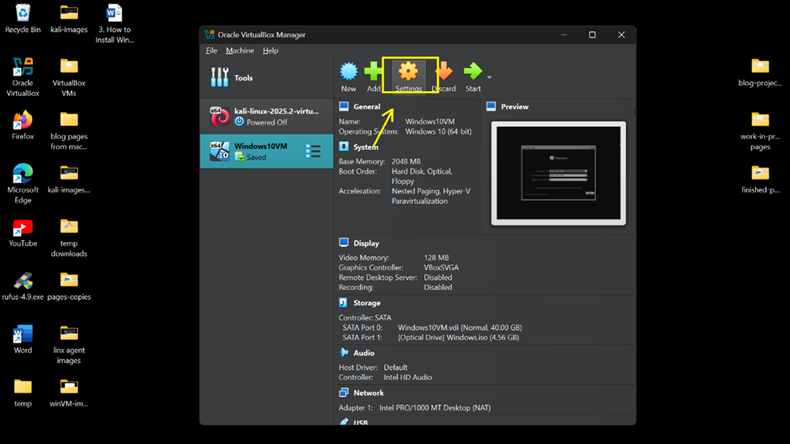 

2\.  Navigate to **Storage**

! **Check the image below**! 
> The Storage setup has to be reconfigured -- You have to
> delete the existing Windows.iso then add an IDE Controller where to
> remount the ISO image file. (At this point I was having problem with the
> installation and this is the solution that fix the issue.)

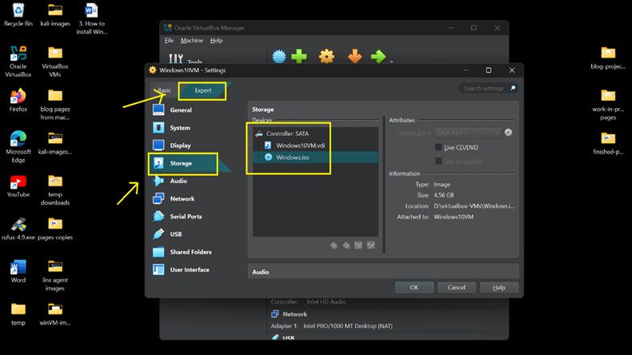 

3\.  Follow the instructions below:

> - First, **delete** the existing **Windows.iso**
>
> - Add an IDE Controller by clicking **Add Controller** button
>
> - Choose **PIIX4 (IDE)**, then remount the Windows.iso

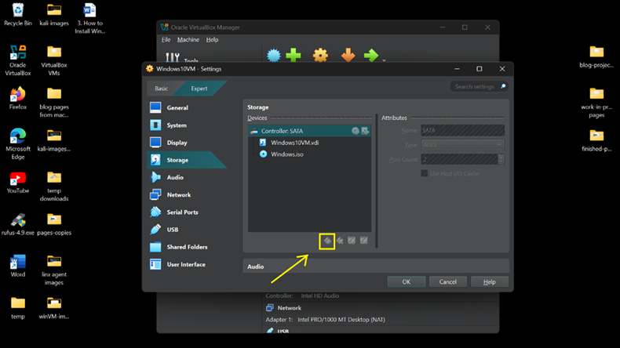 

- The correct Storage setup should look like the image below.

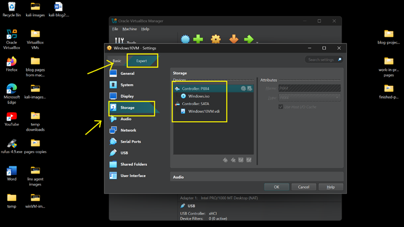 

⸻

### **🚀 Step 4: Start the VM and Install Windows**

1\.  Select the **Windows10VM** → Click **Start**

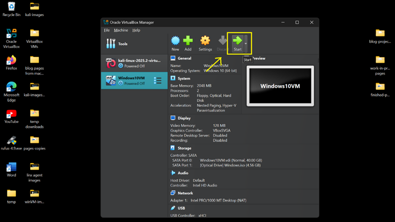 

- The VM will boot into the Windows setup ISO

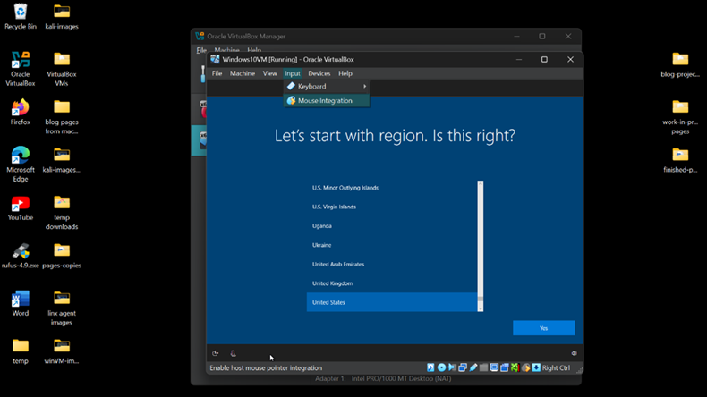 

2\.  **Follow the step-by-step Windows Setup instructions below:**

> **Note:** Since this VM will only be used for lab practice, unnecessary add-ons 
>		are not needed.
>
> - Select Region: **United States**
>
> - Language to install: **English**
>
> - Choose Custom: **Install Windows only**
>
> - Click **Install Now**
>
> - Activate Windows: **I don't have product key** (located at the bottom of box)
>
> - Select OS to install: **Windows 10 Home**
>
> - Click **I accept the license terms**
>
> - Where to install: **Drive 0 Unallocated Space**
>
> - Select Region Again: **United States**
>
> - Keyboard layout: **US**
>
> - Second layout: **Skip**

**Newly installed Windows 10 VM!**

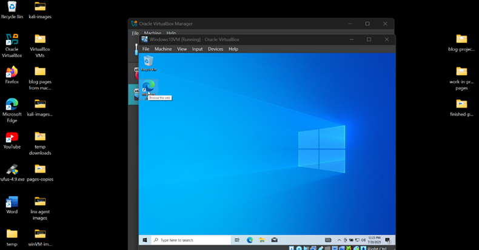 

---

### **🎉 Done!**

> You now have a full Windows VM running in VirtualBox on your system,
> with files stored cleanly on D:\virtualox-VMs\Windows10VM. In the next
> tutorial, we will install the Ubuntu Server VM for our Wazuh SIEM.

[👉 Install Ubuntu Server VM](/4UbuntuServerVM_page.md)

[🔙 Back to Home](../index.md)

