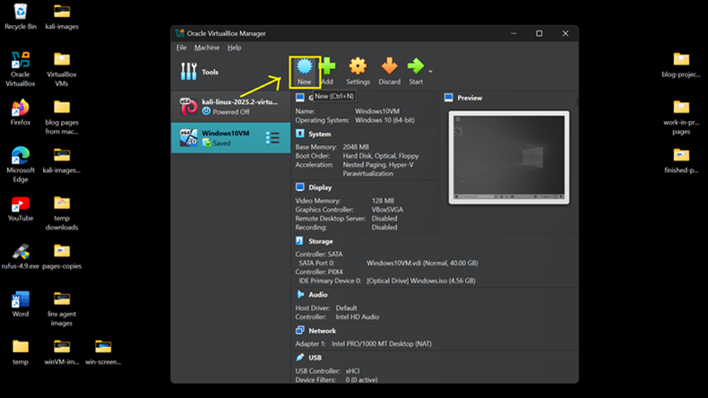
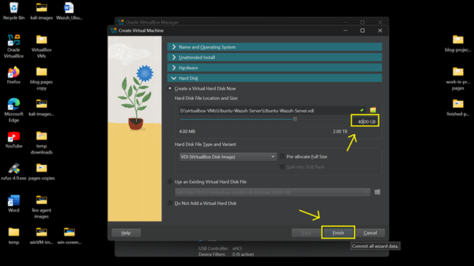
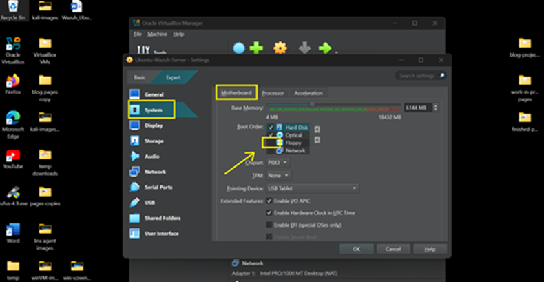

# 🛡️ How to Install Ubuntu Server VM (on Windows 11 -- Stored on Drive D:)

> Wazuh is a powerful open-source platform for threat detection,
> compliance monitoring, and SIEM.
>
> This guide walks you through installing the Wazuh server and Dashboard
> UI on an Ubuntu Server VM
>
> hosted in VirtualBox on Windows 11 --- with all VM files neatly stored
> in your D:\\virtualbox-VMs\\

**💡 Tip:** Installing a headless server may involve command-line
errors, network config issues, or SSH

setup. Keep an AI assistant like **ChatGPT** or **DeepSeek** open for
quick help when you're stuck.

> **You will definitely encounter configuration errors -- keep looking
> for solutions. Patience is a virtue!**

## ✅ Requirements

• 🖥️ Windows 11 with VirtualBox installed

• 📦 Ubuntu Server 24.04 LTS VM (minimum 4 GB RAM, 40 GB storage)

• 🌐 Internet access

• 🔐 Ports 443

⸻

**📥 Step 1: Download Ubuntu Server ISO**

> 1\. Visit: 👉 <https://ubuntu.com/download/server>\
> 2. **Download** Ubuntu Server 22.04 LTS

 
>
> 3\. Go to **Downloads**, then **Cut**
> ubuntu-24.04.02-live-server-amd64-iso to be moved to
> D:\\virtualbox-VMs

 

3\. **Paste** it to: D:\\VirtualBox VMs\\

 

## 🧰 Step 2: Create the Ubuntu Server VM in VirtualBox

1.  Open VirtualBox → Click **New**

 

> 2\. Name: **Ubuntu-Wazuh-Server**\
> 3. ISO Image: click the **drop-down arrow** at the far right \> click
> **other**

 

4\. choose **Windows.iso**, click **Open**

 
5\. Confirm ISO Image: **ubuntu-24.04.2-live-server-amd64.iso**

Type: **Linux**

Subtype: **Ubuntu**

Version: **Ubuntu (64-bit)**

6\. Click **Unattended Install**

 

7\. Change Username: \<your_username\>

Password: \<your_password\>

 

> 8\. Ram: **6MB**\
> 9. CPU: **2**\
> 10. Click **Hard Disk**

 

> 11\. Disk: **VDI, 40 GB**
>
> 12\. Click **Finish**

 

!!! IMPORTANT NOTE: After clicking **finish**, the VM installation will
start automatically.

> It will take 10 -- 15 minutes to install, you'll think that
> installation
>
> freezes from time to time -- just be patient).

13\. After installation, close VM, then power off (shutdown) to modify
Settings.

 

14\. click **Settings**

 

15\. Go to **Systems** **\> Motherboard** \> Uncheck **Floppy**

 

16\. Go to **Storage** \> click Controller IDE: **Empty** \> click
Optical Drive **disk icon** \>

Select **ubuntu-24.04.2-live-server-amd.iso** \> click **OK**

 

- Your Storage setup should look like the image below.

 

- Click **OK**, then click **Start** on VirtualBox, then **log-in** to
  the Ubuntu Server VM.

## 🎉 Done!

You've now installed Ubuntu Server VM on VirtualBox.

The next tutorial will guide you on how to install the Wazuh SIEM on
this Ubuntu Server.

[🔙 Back to Home](../index.md)
