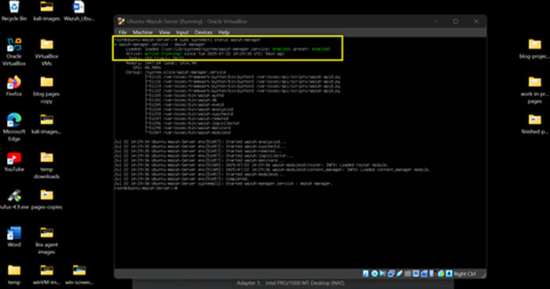
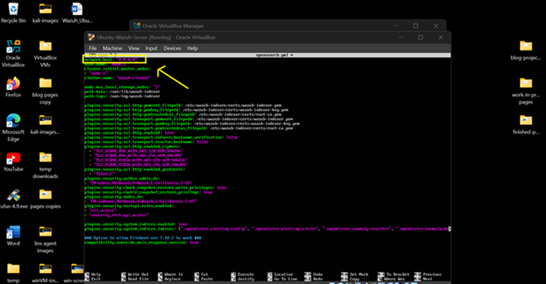

## **🛡️ How to Install Wazuh SIEM on Ubuntu Server**

> If you\'re building a **home lab** to sharpen your cybersecurity
> skills, installing a Security
>
> Information and Event Management (SIEM) tool like **Wazuh** is one of
> the most valuable
>
> setups you can add. Wazuh gives you deep insight into system activity,
> logs, threats, and
>
> even file changes across your environment --- all from a central
> dashboard. It\'s a practical
>
> way to learn how real-world security monitoring works, and it\'s
> commonly used by
>
> professionals in SOC and blue team roles.

---

💡 **Tip:** Keep an **AI assistant** like ChatGPT handy while doing this setup. It can help troubleshoot errors, explain configs, or even generate commands and regex patterns on the fly --- especially helpful when logs or certificates throw unexpected issues!

### 📎 Step 1: Install Wazuh Components: Manager, Indexer, filebeat, and Dashboard

- **Start** Ubuntu-Wazuh-Server VM on VirtualBox

- **Log-in**

1\.  Once logged-in, **type the following commands in order**:

> sudo apt update && sudo apt upgrade -y
>
> sudo apt install curl apt-transport-https lsb-release gnupg -y
>
> curl -sO https://packages.wazuh.com/4.8/wazuh-install.sh
>
> chmod +x wazuh-install.sh
>
> sudo ./wazuh-install.sh -a

- **NOTE**: Installation takes 10 -- 15 minutes.

  **!!! VERY IMPORTANT**: After installation, copy or take a picture of the created credentials (**User** and **Password**). You will need them to access Wazuh's web interface. Check the image below to see where those credentials are located.

 

2\.  Verify if Services are active:

> sudo systemctl status wazuh-manager
>
> sudo systemctl status wazuh-indexer
>
> sudo systemctl status filebeat
>
> sudo systemctl status wazuh-dashboard

- Output should say ** active ** on all the services above:

 

\---
### 🌐 Step 2: Configure opensearch_dashboards.yml and opensearch.yml files 

- To enable browser access to dashboard, we need to modify configuration in the .yml files

1\.  Get your Ubuntu-Wazuh-Server IP address.

> Type: **ip a**
>
> Search for: **inet** (this is the server's ip address, write it down! You will need this for the configuration)

2\.  Navigate to the opensearch_dashboards.yml file. File Location: /etc/wazuh-dashboard/opensearch_dashboards.yml

- To navigate to the target file run the commands below:

> **sudo su**
>
> **cd /**
>
> **cd /etc/wazuh-dashboard**

- To check if the file exists:

> **ls**

- To open the file for editing configuration run command below:

> **nano opensearch_dashboards.yml**

 

- Replace the **opensearch.hosts IP address** with your **inet (Wazuh-server IP address)**

- Close the file: **ctrl + o**, then **enter**, then **control + x**

 

3\.  Navigate to the opensearch.yml file

    - File Location: /etc/wazuh-indexer/opensearch.yml

    - To navigate to the target file run commands below:

> **cd /**
>
> **cd /etc/wazuh-indexer**

- To check if the file exists:

> **ls**

- To open the file for editing configuration run command:

> **nano opensearch.yml**

- Replace the **network.host IP address** with **0.0.0.0** if IP address is different.

- Close the file: **ctrl + o**, then **enter**, then **control + x**

 

\---

### 🔐 Step 3: Access the Wazuh Dashboard

- After configuration, open a browser on Kali-Linux VM or Windows 11 host.

1\.  Visit: https://<**Wazuh-Server IP Address**\>:443 (ex. https://xxx.xxx.xxx.x:443)

2\.  Accept the security warning: click **Advanced...**

 

 

3\. Log in with:

> Username: **admin**\
> Password: \<**the password that was created after wazuh installation, hope you saved it**\>

 

- **The Wazuh Dashboard!**

 

---
## 🎉 Done!

You've now installed Wazuh SIEM on an Ubuntu VM.

The next tutorial will guide you on how to install wazuh agents on the
Kali-Linux VM and the Windows10 VM for a full Wazuh SIEM setup.

[👉 Install Wazuh Agent on Kali-Linux VM](/6KaliAgent_page.md)

[🔙 Back to Home](../index.md)

