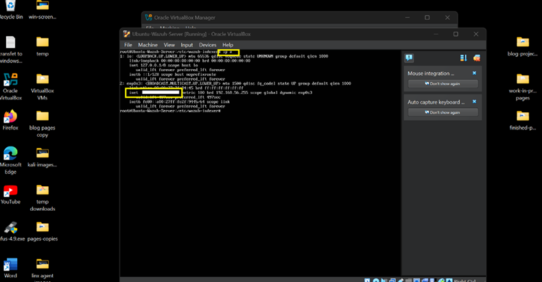
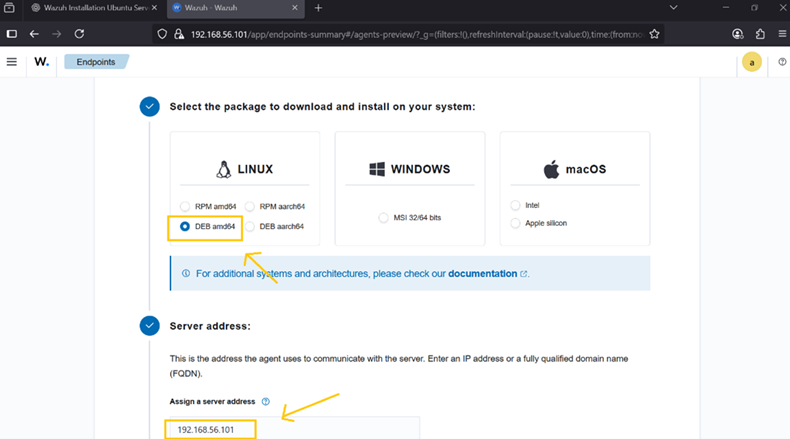
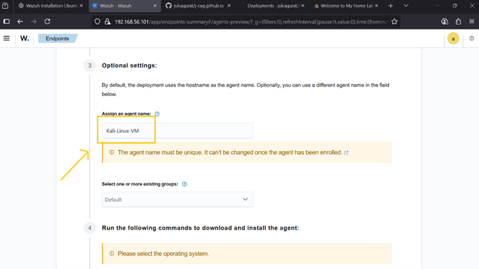
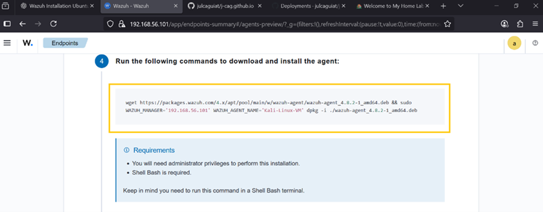
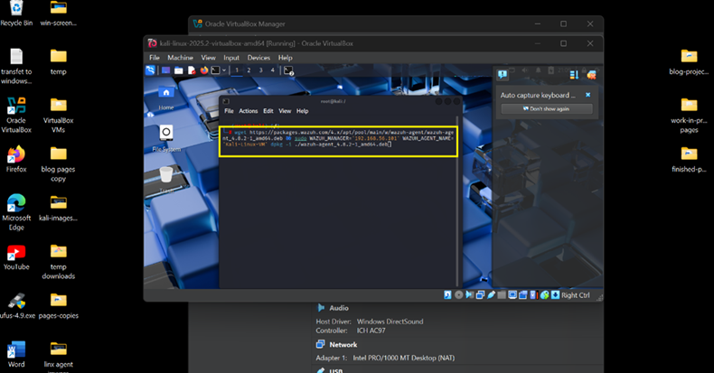
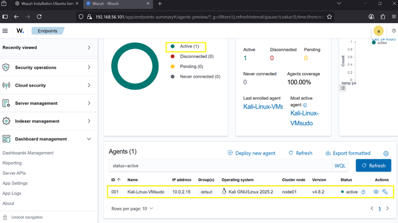

## **🛰️ How to Install the Wazuh Agent on Kali Linux VM**

> This guide walks you through installing the Wazuh Agent on a Kali
> Linux virtual machine and registering it with your Wazuh Server ---
> allowing you to monitor security events, log activity,
>
> and practice SIEM skills in your home lab.

---

**✅ What You Need**

- A Kali Linux VM running in VirtualBox on Windows 11

- A working Wazuh Server installed (on Ubuntu)

- The IP address of your Wazuh Server

- Internet connection on the Kali VM

---

### **🧠 Step 1: Find Your Wazuh Server's IP:**

- On the Ubuntu-Wazuh-Server, run commands:

> **ip a**

       Look for IP address: **inet** (ex. xxx.xxx.xxx.xx) Write it down!

 

⸻

### **🧰 Step 2: Deploy New Agent on Wazuh Dashboard to Kali-Linux**

1\.  **Log-on** to Wazuh Dashboard

2\.  Click **Active**

 

3\.  Click **Deploy new agent**

 

4\.  Click **DEBamd64**

5\.  Assign your **Wazuh-Server IP address**

 

6\.  Assign **Agent Name**

 

7\.  Copy **commands**

 

8\.  Open **Kali-Linux-VM** -\> open **terminal**:

>  Run: **sudo su** (needed for administrator privileges)

9\.  **Paste** the commands from Wazuh Dashboard and run it.

 

10\. Start the agent:

- Run commands: 
>  **sudo systemctl daemon-reload**
>
>  **sudo systemctl enable wazuh-agent**
>
>  **sudo systemctl start wazuh-agent**

11\. Check status, run:

> **sudo systemctl status wazuh-agent**

> ✅ Should say: active (running)

⸻

### **🔄 Step 3: Confirm Agent on Wazuh Dashboard**

- Kali-Linux-VM is now actively monitored by Wazuh SIEM!

 

### 🛡️ **Step 4: Monitor Logs & Events**

- Click on your Kali-Linux-VM agent in the Dashboard to:

> • View security alerts
>
> • Check running processes
>
> • See log entries from /var/log
>
> • Monitor file integrity and rootkit detections

---

### **✅ Done!**

You've now installed the Wazuh Agent on Kali Linux and connected it to
Wazuh SIEM.

The next tutorial will guide you to install Wazuh agent on the Windows
10 VM.

🧠 **Why Monitor Kali?**

- Even though Kali is a penetration testing distro, monitoring it can:

> • Detect reverse shells and lateral movement from labs
>
> • Alert you if exploits succeed
>
> • Attacker/Defender visibility

[👉 Install Wazuh Agent on Kali-Linux VM](/7WinAgent_page.md)

[🔙 Back to Home](../index.md)
