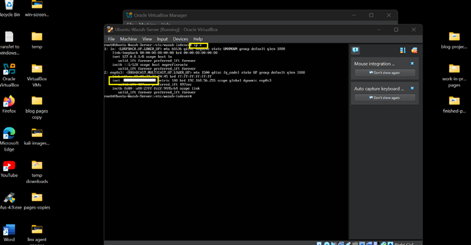
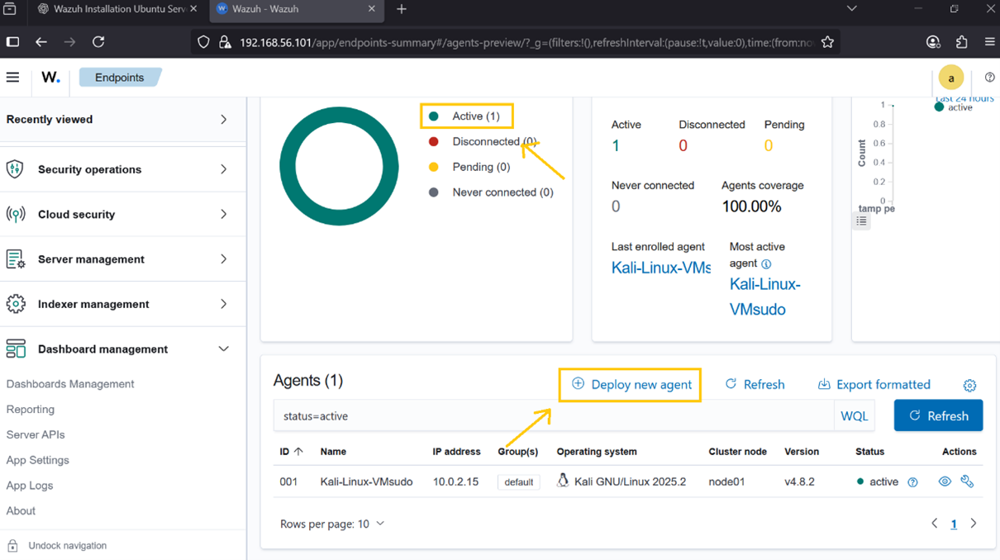
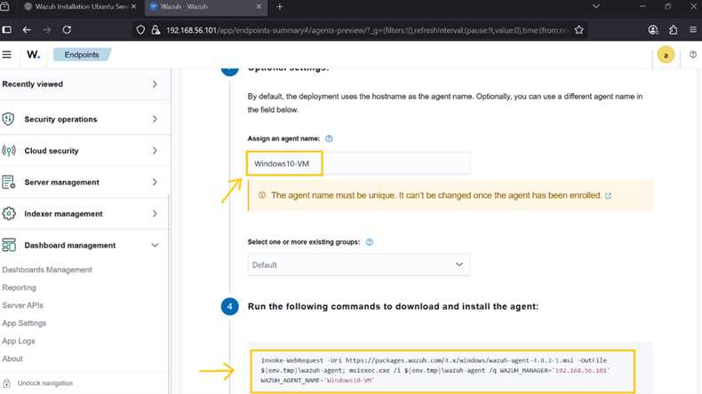
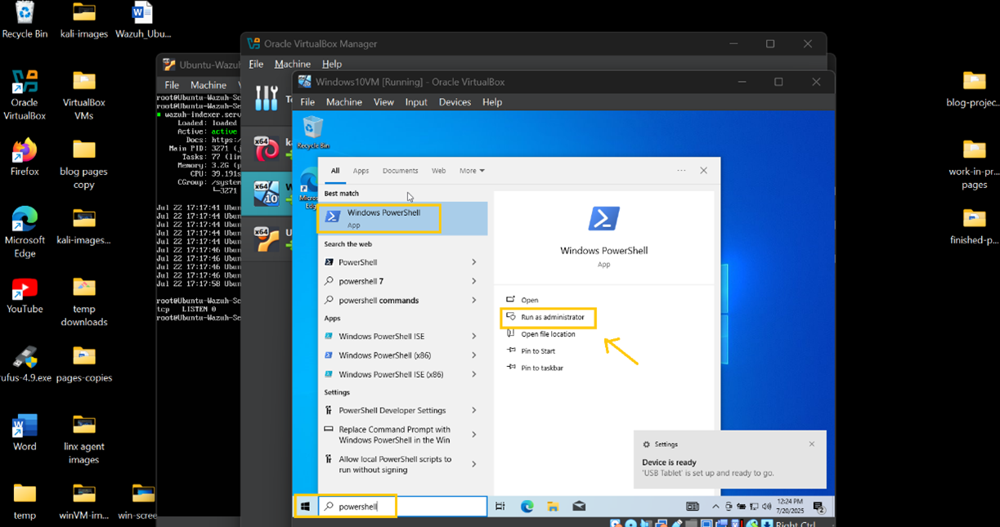
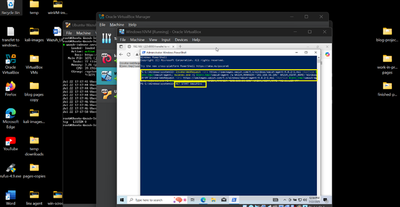
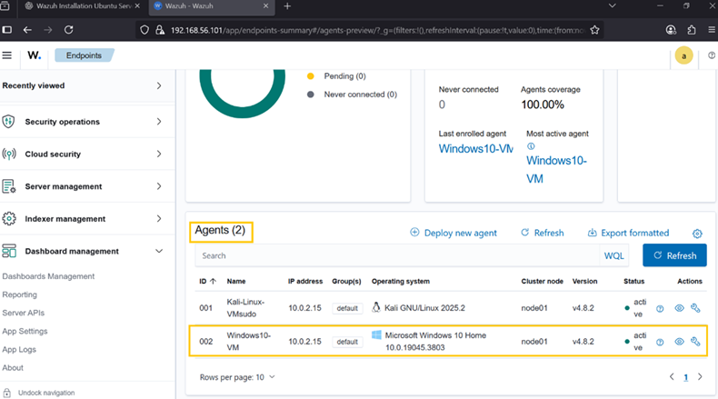

## **🛰️ How to Install Wazuh Agent on a Windows 10 VM**

> The Wazuh Agent runs on endpoints and sends logs, events, and security 
> data to the Wazuh Manager for analysis. This tutorial will guide you
> through installing and registering the Wazuh Agent on a Windows 10 VM to the SIEM.

---

**✅ What You Need**

- A Windows 10 VM running in VirtualBox on your Windows 11 host

- A working Wazuh Server (on Ubuntu VM), installed using the previous guide

- The IP address of the Wazuh Server

- Internet access on the Windows 10 VM

---

### **🌐 Step 1: Find Your Wazuh Server's IP Address**

- On your Ubuntu VM (Wazuh Server), run:

> **ip a**

       Look for IP address: **inet** (ex. xxx.xxx.xxx.xx) Write it down!

 

⸻

### **🧰 Step 2: Deploy New Agent on Wazuh Dashboard to Kali-Linux**

1\.  **Log-on** to Wazuh Dashboard

2\.  Click **Active**

3\.  Click **Deploy new agent**

 

4\.  Click **MSI 32/64 bits**

5\.  Assign your **Wazuh-Server IP address**

 

6\.  Assign **Agent Name**

7\.  Copy **commands**

 

8\.  Open **Windows10-VM** -\> open **PowerShell as Administrator**:

 

9\.  **Paste** the commands from Wazuh Dashboard and run it.

10\.  Then run: 

> **NET START WazuhSvc**

 

⸻

### **🔄 Step 3: Confirm Agent Appears in Wazuh Dashboard**

- Windows10-VM is now actively monitored by Wazuh.

{ 

###**Step 4: Monitor Logs & Events**

⸻

- Click on your Windows10-VM agent in the Dashboard to:

> • View alerts
>
> • Check file integrity logs
>
> • Monitor services and system events

---
## **✅ Done!**

> You've now installed the Wazuh Agent on Windows 10 VM and connected it 
> to your Wazuh Server.
> The next tutorial will be downloading and installing pfSense to serve as firelwall.

**🔎 What You Can Monitor Now:**

> • Windows Event Logs (login failures, policy changes, etc.)
>
> • File Integrity Monitoring (FIM)
>
> • Registry changes
>
> • Installed apps and services

[👉 Install psSense](/8pfSense-install.md)

[🔙 Back to Home](../index.md)
