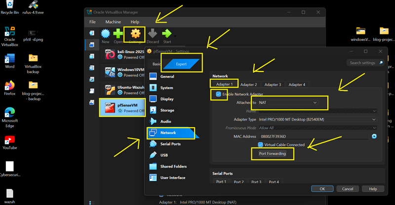
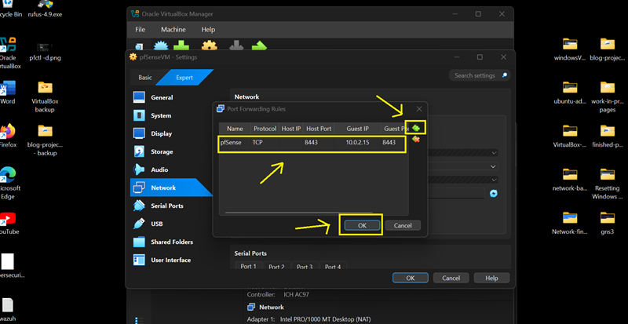
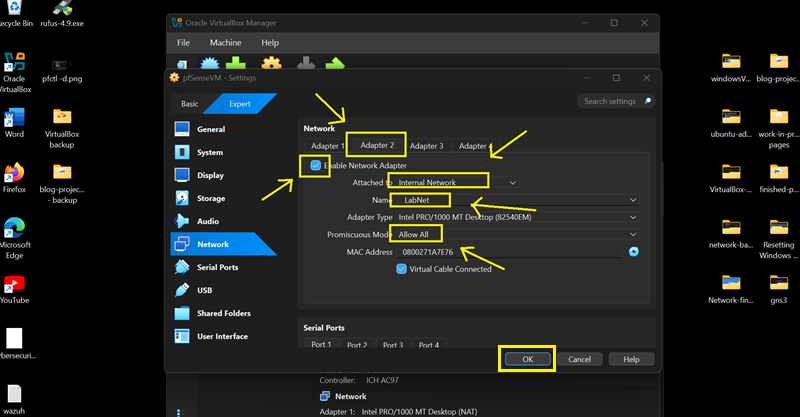
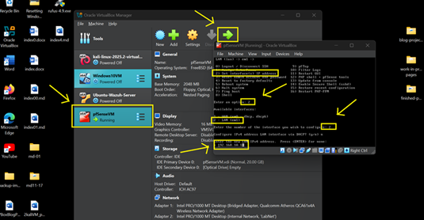
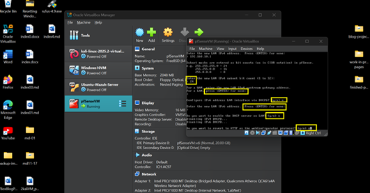
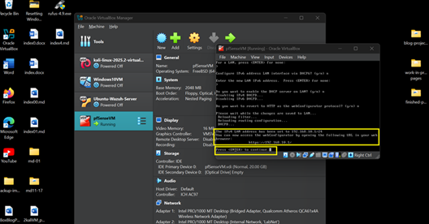
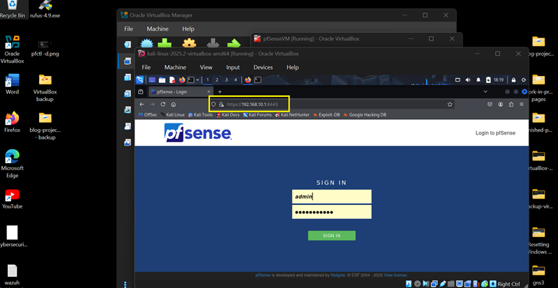



## 🛡️ Part 1: pfSense VM --- Adapter Settings & LAN IP Configuration

### 📌Introduction

       In this part of the lab, we'll configure pfSense as the firewall and 
       gateway for our VirtualBox SOC setup. We'll attach two adapters (WAN and LAN) 
       and assign a static LAN IP.

### 💡Tip: Keep ChatGPT Handy

      If pfSense doesn't boot or your LAN IP won't respond, ask ChatGPT: 
       "I'm setting up pfSense in VirtualBox with NAT + Internal adapters. 
       LAN should be 192.168.10.1 but it's not reachable. Here's my adapter 
       setup and console output: <_____>. What should I check?"

### 🔹 Step 1: pfSense Adapters (Adapters: 1 \[WAN\] &  2 \[LAN\]) Configuration

       1. **Power off** the pfSense VM.

       2. Open **Settings** → **Network**.

       - **Adapter 1** (WAN):

       **Note:** We are using NAT for Internet Access and Port Forwarding 
       and for Host to have access to pfSense GUI.

       		- Check **Enable Network Adapter[✓]
       		- Attached to: **NAT**
       		- Promiscuous Mode: **Allow All**
       		- Click **Port Forwarding**

       

       3\. Click **'+'** (Add button) to set Port Forwarding Rules:

       		- Name: 		**pfSense**
       		- Protocol:  	**TCP**
       		- Host IP: 		**(leave blank)**
       		- Host Port: 	**8443**
       		- Guest IP: 	**10.0.2.15**
       		- Guest Port: 	**8443**

       4\. Click **OK**

       

       - **Adapter 2** (LAN):

       		- Check **Enable Network Adapter[✓]**
       		- Attached to: **Internal Network**
       		- Name: **LabNet** (or any name you want, just make sure that 
       all VMs have the same network name.
       		- Promiscuous Mode**: Allow All**
       - Click **OK** to save settings and exit.

       
       

---
       
### 🔹 Step 2: Configure LAN Static IP

       1.  Boot pfSense and assign interfaces and Static IP Addresses to:

       		- em0 → WAN (NAT) 	this will be automatically assigned by VirtualBox.
       - em1 → LAN (LabNet)	we will configure this manually.

       2. From pfSense console menu, **choose (2)** - Set interface(s) IP address.
       3. Select LAN: **choose (2)**
       4. Enter **Static IP Address**:

       		- IPv4 address: **192.168.10.1**

       

       - Subnet mask (CIDR):	**/24**
- Gateway: 			**(leave blank)**
       		- IPv6: 			**none**
       		- DHCP server: 		**No** (because we are using Static IP address for our LAN)
       - Keep HTTPS 		**enabled**

       

       5\. Press **ENTER** to continue

       
	
       - The Static IP Address of pfSense VM is now set to **192.168.10.1**

       - The pfSense Firewall GUI can be access by opening the following URL on 
       Kali Linux or Windows10 VM browser after their Adapter setup:
       
       	https://192.168.10.1:8443
       
       	Default User Name: **admin**
       	Default Password: **admin**

       	or

       	You can try to access from your host machine' browser. (This is the 
       	reason why we set Port Forwarding on NAT. If the host browser can't access the
       **pfSense GUI**, on the pfSense VM console -- select option (**8**) Shell, 
       then run **pfctl -d** to temporarily disable packet filtering.

       	Then, try accessing the pfSense Firewall GUI from the host's browser to set 
       or reset the password.

       	https://127.0.0.1:8443
       	https://192.168.10.1:8443
       	https://localhost:8443
       
       

---
       <!-- [👉 Install Ubuntu Server VM](/4UbuntuServerVM_page.md)→

       [🔙 Back to Home\](../index.md)
