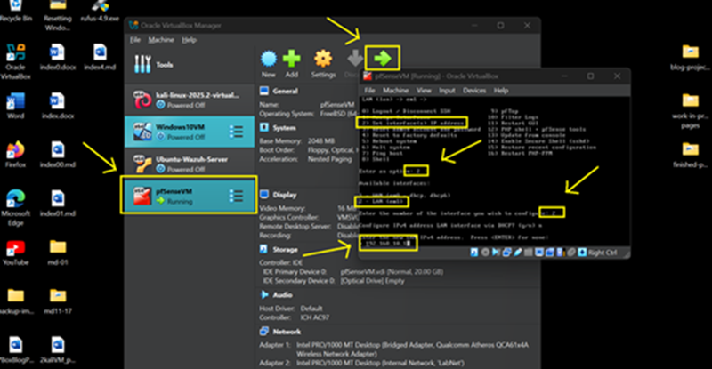
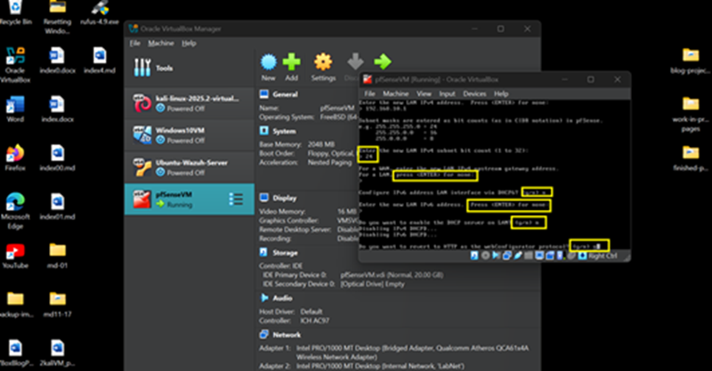

## 🛡️ Part 1: pfSense VM — Adapter Settings & LAN IP Configuration

### 📌 Introduction

    In this part of the lab, we’ll configure the pfSense firewall VM with two network adapters: NAT for external access, allowing updates and remote management from the host, and Internal Network for LAN connectivity. pfSense will serve as the central firewall and gateway, managing traffic between the Internet and internal networks. We will not use DHCP, as all devices in the lab will be assigned static IP addresses for consistent communication.

### 💡 Tip: Keep ChatGPT Handy

    If pfSense doesn't boot or your LAN IP won't respond, here's a sample prompt for ChatGPT:  
    
    "I'm setting up pfSense in VirtualBox with NAT + Internal adapters LAN should be 192.168.10.1   
    but it's not reachable. Here's my adapter setup and console output: <_____>. What should I check?"

---

### 🔹 Step 1: pfSense Adapters [1 (WAN) & 2 (LAN)] Configuration

1. **Power off** the pfSense VM.

2. Navigate **Settings** → **Network**.

- **Adapter 1 (WAN):**

  - Check **Enable Network Adapter** [✓]
  - Attached to: **NAT**
  - Promiscuous Mode: **Allow All**
  - Click **Port Forwarding**

3. Click **'+'** (Add button) to add Port Forwarding Rules:

- Set the Following:

  - Name: **pfSense**
  - Protocol: **TCP**
  - Host IP: **(leave blank)**
  - Host Port: **8443**
  - Guest IP: **10.0.2.15**
  - Guest Port: **8443**

4. Click **OK**
	

- **Adapter 2 (LAN):**

  - Check **Enable Network Adapter** [✓]
  - Attached to: **Internal Network**
  - Name: **LabNet** (or any name you want, just make sure all VMs have the same network name)
  - Promiscuous Mode: **Allow All**
  - Click **OK** to save settings and exit.  

---

### 🔹 Step 2: Configure LAN Static IP Address

1. Boot pfSense VM

2. Assign interfaces and Static IP Addresses:

> em0 → **WAN (NAT)** → IP address automatically assigned by VirtualBox  
> em1 → **LAN (Internal Network)** → IP address
to be configured manually (Static IP)
       
**On pfSense Console Menu:**

- Enter/Answer as follows:

  - Enter an Option: enter **2** (Set Interface(s) IP address)
  - Enter the number of the interface: enter **2** (LAN (em1))
  - Configure IPv4 address LAN Interface via DHCP: enter **n** (we are going to set static IP address)
  - Enter the new LAN IPv4 address: enter **192.168.10.1**

- Enter/Answer as follows:

  - Enter the new LAN IPv4 subnet mask: **24** (w/c is 255.255.255.0 or /24 in CIDR notation)
  - For a WAN, enter the new … For a LAN, press <ENTER>: (leave blank) press **ENTER**
  - Configure IPv6 address LAN interface …: enter **n**
  - Enter the new LAN IPv6 … Press <ENTER>: (leave blank) press **ENTER**
  - Do you want to enable the DHCP server …: enter **n** (we are using static IP for LAN)
  - Do you want to revert to HTTPS …: enter **n**

3. Press **\<ENTER\>** to continue  → (**you are done!**) 

 

- The Static IP Address of pfSense VM is now set to **192.168.10.1**  
- The pfSense Firewall GUI can be accessed using the URL below from Kali Linux
  or Windows 10 VM browser after their adapter setup:

    **→ https://192.168.10.1:8443**

> 	Default Username: admin  
> 	Default Password: admin

- **Or**, try from your host machine’s browser (thanks to NAT Port Forwarding). 
 
- **If access fails:**  

1. On pfSense VM console, select option **(8) Shell**  
2. Run `pfctl -d` to temporarily disable packet filtering  
3. Then try the URLs below:  

&nbsp;&nbsp;&nbsp;&nbsp; **https://127.0.0.1:8443**
&nbsp;&nbsp;&nbsp;&nbsp; **https://192.168.10.1:8443**
&nbsp;&nbsp;&nbsp;&nbsp; **https://localhost:8443**

---
👉 [Part 2.b: Kali-Linux VM Network Configuration](10kali2.md) 

🔙 [Back to Home](../index.md) 
